# AWS Tech Specs v2

High-Level Summary of Requirements:
- Multi-project monorepo architecture
- Centralized authentication using Cognito
- Domain-based routing with subdomains
- Frontend hosting on S3/CloudFront
- Backend APIs on ECS with FastAPI
- CI/CD pipelines for all components
- LLM integration with Bedrock
- PostgreSQL database on RDS
- Audio generation with Polly
- Image generation capabilities
- S3 for object storage
- Enhanced LLM security with guardrails

Domain & Authentication Architecture:

Root Domain: app-dw.net
Subdomains:
- auth.app-dw.net (Cognito hosted UI)
- lang-portal.app-dw.net (CloudFront + S3/ALB)
- haiku.app-dw.net (CloudFront + S3/ALB)
- vocab.app-dw.net (ALB + ECS Streamlit)
- writing.app-dw.net (ALB + ECS Gradio)

Infrastructure as Code (CDK): Should include stacks for:
- Network Stack (VPC, subnets, security groups)
- Authentication Stack (Cognito)
- Database Stack (RDS)
- Storage Stack (S3 buckets)
- Frontend Stack (per project)
  - CloudFront + S3 for React apps
  - ECS for Streamlit/Gradio apps
- Backend Stack (per project)
- CI/CD Stack (per project)
- Monitoring Stack

Project-Specific Components:

A. Lang Portal:

```mermaid
graph LR
    CloudFront[🌐 CloudFront] --> S3_Frontend[📦 S3 Frontend]
    CloudFront --> ALB[🌐 ALB]
    ALB --> ECS_FastAPI[🐳 ECS FastAPI]
    ECS_FastAPI --> Bedrock[🤖 Bedrock]
    ECS_FastAPI --> RDS_Postgres[💾 RDS Postgres]
    ECS_FastAPI --> Polly[🗣️ Polly]
    ECS_FastAPI --> Image_Generation[🖼️ Image Generation]
```

B. Haiku Generator:

```mermaid
graph LR
    CloudFront[🌐 CloudFront] --> S3_Frontend[📦 S3 Frontend]
    CloudFront[🌐 CloudFront] --> S3_Media[📦 S3 Media]
    CloudFront --> ALB[🌐 ALB]
    ALB --> ECS_FastAPI[🐳 ECS FastAPI]
    ECS_FastAPI --> Bedrock[🤖 Bedrock]
    ECS_FastAPI --> RDS_Postgres[💾 RDS Postgres]
    ECS_FastAPI --> S3_Media
```

C. Vocab Generator:

```mermaid
graph LR
    ALB[🌐 ALB] --> ECS_Streamlit[🐳 ECS Streamlit]
    ECS_Streamlit --> ECS_FastAPI[🐳 ECS FastAPI]
    ECS_Streamlit --> LangPortal_API[🚀 Lang Portal API]
    ECS_FastAPI --> Bedrock[🤖 Bedrock]
    ECS_FastAPI --> Polly[🗣️ Polly]
```

D. Writing Practice:

```mermaid
graph LR
    ALB[🌐 ALB] --> ECS_Gradio[🐳 ECS Gradio]
    ECS_Gradio --> Bedrock[🤖 Bedrock]
    ECS_Gradio --> LangPortal_API[🚀 Lang Portal API]
```

Service Selection Options:

A. Frontend Hosting:
- S3 + CloudFront (recommended for React apps: Lang Portal, Haiku) (Yes)
- ECS Fargate (for Streamlit/Gradio apps: Vocab, Writing) (Yes)
- App Runner (alternative for Streamlit/Gradio) (No)

B. Backend API:
- API Gateway + Lambda (No)
- Application Load Balancer + ECS (Yes)
- App Runner (for simpler deployments) (No)

C. Database:
- Amazon RDS for PostgreSQL (No)
- Amazon Aurora PostgreSQL (for higher scalability) (Yes)
- Amazon RDS Proxy (for connection pooling) (Yes)

D. Image Generation:
- Stable Diffusion on SageMaker (No)
- Bedrock with Stable Diffusion models (Yes)
- Third-party APIs through API Gateway (No)

Security Considerations:
- WAF rules for CloudFront
- Network isolation in VPC
- Secrets management with Secrets Manager
- IAM roles and policies
- Cognito user pools and identity pools
- SSL/TLS certificates with ACM

CI/CD Pipeline:
- CodePipeline with GitHub source
- CodeBuild for building containers
- CodeDeploy for ECS deployments
- S3 deployment for static assets
- Separate pipelines per project
- Path-based triggers for monorepo

Monitoring and Logging:
- CloudWatch Logs
- CloudWatch Metrics
- X-Ray tracing
- CloudWatch Application Insights
- CloudWatch Alarms
- AWS Distro for OpenTelemetry

Network Infrastructure Questions:
- Do you need multi-region deployment or single region? single region
- What's your expected traffic pattern for sizing the VPC? balanced traffic
- Do you need direct connect or VPN connectivity? no

Recommended Network Stack:
VPC Configuration:
- Region: Single region (suggest us-east-1 for best service availability)
- CIDR: 10.0.0.0/16
- 3 AZs with:
  - Public subnets (10.0.0.0/24, 10.0.1.0/24, 10.0.2.0/24)
  - Private subnets (10.0.3.0/24, 10.0.4.0/24, 10.0.5.0/24)
  - Database subnets (10.0.6.0/24, 10.0.7.0/24, 10.0.8.0/24)
- Single NAT Gateway in public subnet of first AZ (cost-optimized)
- Public subnets (for ALB and NAT Gateways)
- Private subnets (for ECS Fargate and Aurora)
- Database subnets (isolated)
- VPC endpoints for:
  - ECR (docker pulls)
  - S3
  - Secrets Manager
  - CloudWatch Logs
  - Bedrock

Container Infrastructure Questions:
- What's your expected peak concurrent users? low, maybe 100 users
- Do you need auto-scaling for each service? yes
- What resource requirements (CPU/Memory) for each container type? let's start with 1 vCPU and 2GB memory

Recommended ECS Configuration:
ECS Fargate Configuration:
- Capacity Providers: FARGATE_SPOT (cost optimization)
- Service Auto Scaling:
  - Target tracking scaling
  - CPU utilization target: 70%
  - Memory utilization target: 70%
  - Scale-in cooldown: 300 seconds
  - Scale-out cooldown: 60 seconds
   - Essential containers:
     - app
     - aws-otel-collector (sidecar)

# React Apps Backend
API Services:
  CPU: 1 vCPU
  Memory: 2GB
  Auto-scaling:
    Min: 1
    Max: 3

# Streamlit/Gradio Apps
Frontend Services:
  CPU: 2 vCPU    # Higher resources for UI rendering
  Memory: 4GB
  Auto-scaling:
    Min: 1
    Max: 2

Task Definition per application:
- Lang Portal
- Haiku Generator
- Writing Practice
- Vocab Generator Streamlit
- Vocab Generator FastAPI

Database Infrastructure Questions:
- What's your expected database size? below 1 GB
- Do you need read replicas? no
- What's your RTO/RPO requirements? 1 day
- Maximum number of concurrent database connections? enough to support 100 concurrent users

Recommended Aurora Configuration:
Aurora PostgreSQL Setup:
- Multi-AZ deployment
- Instance classes: 
  - Primary: db.t4g.medium (minimum)
  - Reader: db.t4g.medium (if needed)
- Auto-scaling for storage
- Backup retention: 7 days minimum
- Performance Insights enabled

RDS Proxy Configuration:
- Connection pooling enabled
- IAM authentication
- Auto-scaling connections
- VPC security group isolation
- Separate proxy endpoints for read/write

Security Infrastructure Questions:
- Do you need HIPAA or other compliance requirements? no
- What's your session management strategy? session should be shared across domain
- Do you need WAF rules for specific threats? basic threat protection

Recommended Security Configuration:
Security Controls:
- WAF rules on CloudFront and ALB
- Network ACLs for subnet isolation
- Security Groups:
  - ALB (inbound 443)
  - ECS (inbound from ALB only)
  - Aurora (inbound from ECS and RDS Proxy)
  - RDS Proxy (inbound from ECS only)

WAF Configuration:
- AWS Managed Rules:
  - Core rule set
  - Known bad inputs
  - IP reputation list
- Rate limiting: 2000 requests per IP per 5 minutes
- Geo-blocking: None (unless specific countries need to be blocked)

Session Management:
- Cognito User Pools:
  - Token validity: 1 hour
  - Refresh token validity: 30 days
  - Remember device: Enabled
  - Advanced security mode: Audit only

Monitoring Infrastructure Questions:
- What's your logging retention requirement? 7 days
- Do you need real-time alerting? yes
- What metrics are critical for your applications? crashes, hack attempts, and guardrail violations

Recommended Monitoring Setup:
Observability Stack:
- CloudWatch Log Groups:
  - ECS container logs
  - Aurora logs
  - ALB access logs
  - WAF logs
- CloudWatch Metrics:
  - Custom metrics for application health
  - ECS service metrics
  - Aurora performance metrics
- X-Ray tracing:
  - API traces
  - Database queries
  - Third-party calls

CloudWatch:
- Log retention: 7 days
- Metrics: 1-minute resolution
- Dashboards per service

Alarms:
1. Application Health:
   - 5xx errors > 5% in 5 minutes
   - API latency > 1 second p95
   - Failed ECS task count > 0

2. Security:
   - WAF block count spike
   - Failed authentication attempts
   - Guardrail violation count

3. Infrastructure:
   - CPU/Memory utilization > 85%
   - Database connections > 80%
   - Database storage < 20% free

Load Balancer Configuration:
Application Load Balancer Structure:
Primary ALB:
- Internet-facing
- Multi-AZ (3 zones)
- SSL/TLS termination
- WAF integration
- Access logging enabled

Target Groups Configuration:
Lang Portal:
- API:
  - Protocol: HTTP
  - Port: 8000
  - Target type: IP
  - Health check:
    - Path: /api/health
    - Interval: 30 seconds
    - Timeout: 5 seconds
    - Healthy threshold: 2
    - Unhealthy threshold: 3
    - Success codes: 200

Haiku Generator:
- API:
  - Protocol: HTTP
  - Port: 8000
  - Target type: IP
  - Health check:
    - Path: /api/health
    - Interval: 30 seconds
    - Timeout: 5 seconds
    - Healthy threshold: 2
    - Unhealthy threshold: 3
    - Success codes: 200

Vocab Generator:
- API:
  - Protocol: HTTP
  - Port: 8000
  - Target type: IP
  - Health check:
    - Path: /api/health
    - Interval: 30 seconds
    - Timeout: 5 seconds
    - Healthy threshold: 2
    - Unhealthy threshold: 3
    - Success codes: 200

- Frontend (Streamlit):
  - Protocol: HTTP
  - Port: 8501
  - Target type: IP
  - Health check:
    - Path: /healthz
    - Interval: 30 seconds
    - Timeout: 5 seconds
    - Healthy threshold: 2
    - Unhealthy threshold: 3
    - Success codes: 200

Writing Practice:
- Frontend (Gradio):
  - Protocol: HTTP
  - Port: 7860
  - Target type: IP
  - Health check:
    - Path: /view_api
    - Interval: 30 seconds
    - Timeout: 5 seconds
    - Healthy threshold: 2
    - Unhealthy threshold: 3
    - Success codes: 200

Listener Rules:
HTTPS:443
Rules priority (lang-portal.app-dw.net):
1. /api/* -> Lang Portal API target group
2. /* -> Lang Portal Frontend target group

Rules priority (vocab.app-dw.net):
1. /* -> Vocab Generator Frontend target group

Rules priority (writing.app-dw.net):
1. /* -> Writing Practice Frontend target group

Rules priority (haiku.app-dw.net):
1. /api/* -> Haiku Generator API target group
2. /* -> Haiku Generator Frontend target group

HTTP:80
- Redirect to HTTPS:443

DNS Records (Route 53):
- lang-portal.app-dw.net -> CloudFront Distribution
- vocab.app-dw.net -> Primary ALB
- writing.app-dw.net -> Primary ALB
- haiku.app-dw.net -> CloudFront Distribution

Container Deployment Strategy:
ECS Fargate Configuration:
Capacity Providers:
- FARGATE_SPOT (cost optimization)
- Service Auto Scaling:
  - Target tracking scaling
  - CPU utilization target: 70%
  - Memory utilization target: 70%
  - Min capacity: 1
  - Max capacity: 3
  - Scale-in cooldown: 300 seconds
  - Scale-out cooldown: 60 seconds
   - Essential containers:
     - app
     - aws-otel-collector (sidecar)

Task Definition per application:
Lang Portal:
  Container Definition:
    - Name: fastapi-app
      Image: ${ECR_REPO}/lang-portal-api:${TAG}
      Essential: true
      PortMappings:
        - ContainerPort: 8000
      Environment:
        - Name: AWS_DEFAULT_REGION
          Value: us-east-1
      Secrets:
        - Name: DATABASE_URL
          ValueFrom: arn:aws:secretsmanager:region:account:secret:database-url
        - Name: JWT_SECRET
          ValueFrom: arn:aws:secretsmanager:region:account:secret:jwt-secret
      HealthCheck:
        Command: ["CMD-SHELL", "curl -f http://localhost:8000/health || exit 1"]
        Interval: 30
        Timeout: 5
        Retries: 3
        StartPeriod: 60

Haiku Generator:
  Container Definition:
    - Name: fastapi-app
      Image: ${ECR_REPO}/haiku-api:${TAG}
      Essential: true
      PortMappings:
        - ContainerPort: 8000
      Environment:
        - Name: AWS_DEFAULT_REGION
          Value: us-east-1
      Secrets:
        - Name: DATABASE_URL
          ValueFrom: arn:aws:secretsmanager:region:account:secret:database-url
      HealthCheck:
        Command: ["CMD-SHELL", "curl -f http://localhost:8000/health || exit 1"]
        Interval: 30
        Timeout: 5
        Retries: 3
        StartPeriod: 60

Vocab Generator Frontend:
  Container Definition:
    - Name: streamlit-app
      Image: ${ECR_REPO}/vocab-generator-frontend:${TAG}
      Essential: true
      PortMappings:
        - ContainerPort: 8501
      Environment:
        - Name: AWS_DEFAULT_REGION
          Value: us-east-1
      Secrets:
        - Name: LANG_PORTAL_API_KEY
          ValueFrom: arn:aws:secretsmanager:region:account:secret:lang-portal-api-key
      HealthCheck:
        Command: ["CMD-SHELL", "curl -f http://localhost:8501/healthz || exit 1"]
        Interval: 30
        Timeout: 5
        Retries: 3
        StartPeriod: 60

Vocab Generator Backend:
  Container Definition:
    - Name: fastapi-app
      Image: ${ECR_REPO}/vocab-generator-backend:${TAG}
      Essential: true
      PortMappings:
        - ContainerPort: 8000
      Environment:
        - Name: AWS_DEFAULT_REGION
          Value: us-east-1
      Secrets:
        - Name: LANG_PORTAL_API_KEY
          ValueFrom: arn:aws:secretsmanager:region:account:secret:lang-portal-api-key
      HealthCheck:
        Command: ["CMD-SHELL", "curl -f http://localhost:8000/health || exit 1"]
        Interval: 30
        Timeout: 5
        Retries: 3
        StartPeriod: 60

Writing Practice:
  Container Definition:
    - Name: gradio-app
      Image: ${ECR_REPO}/writing-practice:${TAG}
      Essential: true
      PortMappings:
        - ContainerPort: 7860
      Environment:
        - Name: AWS_DEFAULT_REGION
          Value: us-east-1
      Secrets:
        - Name: LANG_PORTAL_API_KEY
          ValueFrom: arn:aws:secretsmanager:region:account:secret:lang-portal-api-key
      HealthCheck:
        Command: ["CMD-SHELL", "curl -f http://localhost:7860/view_api || exit 1"]
        Interval: 30
        Timeout: 5
        Retries: 3
        StartPeriod: 60

Service Discovery:
Cloud Map Configuration:
  Namespace: app-dw.internal
  Services:
    - lang-portal-api
    - vocab-generator-backend

Deployment Configuration:
Deployment Strategy:
  Type: ECS Rolling Update
  Maximum Percent: 200
  Minimum Healthy Percent: 100
  Circuit Breaker:
    Enable: true
    Rollback: true

Deployment Configuration:
  - Health check grace period: 60 seconds
  - Service discovery TTL: 60 seconds
  - Deregistration delay: 30 seconds

Container Logging:
Log Configuration:
  LogDriver: awslogs
  Options:
    awslogs-group: /ecs/app-dw
    awslogs-region: us-east-1
    awslogs-stream-prefix: ecs

Security Group Configuration:
Load Balancer Security Groups:
ALB Security Group:
  Name: alb-sg
  Inbound Rules:
    - Type: HTTP (80)
      Source: 0.0.0.0/0
      Description: "Allow HTTP for redirect"
    # For Streamlit/Gradio apps (direct access)
    - Type: HTTPS (443)
      Source: 0.0.0.0/0
      Description: "Allow HTTPS from internet for Streamlit/Gradio apps"
    # For React apps (CloudFront access)
    - Type: HTTPS (443)
      Source: CloudFront Managed Prefix List
      Description: "Allow HTTPS from CloudFront for React apps"
  Outbound Rules:
    - Type: All Traffic
      Destination: VPC CIDR
      Description: "Allow all outbound within VPC"

Application Security Groups:
Lang Portal API Security Group:
  Name: lang-portal-api-sg
  Inbound Rules:
    - Type: HTTP (8000)
      Source: alb-sg
      Description: "Allow traffic from ALB"
    - Type: HTTP (8000)
      Source: vocab-generator-sg
      Description: "Allow traffic from Vocab Generator"
    - Type: HTTP (8000)
      Source: writing-practice-sg
      Description: "Allow traffic from Writing Practice"
  Outbound Rules:
    - Type: All Traffic
      Destination: 0.0.0.0/0
      Description: "Allow all outbound"

Haiku Generator API Security Group:
  Name: haiku-api-sg
  Inbound Rules:
    - Type: HTTP (8000)
      Source: alb-sg
      Description: "Allow traffic from ALB"
  Outbound Rules:
    - Type: All Traffic
      Destination: 0.0.0.0/0
      Description: "Allow all outbound"

Vocab Generator Security Group:
  Name: vocab-generator-sg
  Inbound Rules:
    - Type: HTTP (8501)
      Source: alb-sg
      Description: "Allow traffic from ALB for Streamlit"
    - Type: HTTP (8000)
      Source: vocab-generator-sg
      Description: "Allow internal traffic between frontend and backend"
  Outbound Rules:
    - Type: All Traffic
      Destination: 0.0.0.0/0
      Description: "Allow all outbound"

Writing Practice Security Group:
  Name: writing-practice-sg
  Inbound Rules:
    - Type: HTTP (7860)
      Source: alb-sg
      Description: "Allow traffic from ALB"
  Outbound Rules:
    - Type: All Traffic
      Destination: 0.0.0.0/0
      Description: "Allow all outbound"

Database Security Groups:
Lang Portal Aurora Security Group:
  Name: lang-portal-aurora-sg
  Inbound Rules:
    - Type: PostgreSQL (5432)
      Source: lang-portal-api-sg
      Description: "Allow traffic from Lang Portal API"
  Outbound Rules:
    - Type: All Traffic
      Destination: VPC CIDR
      Description: "Allow all outbound within VPC"

Lang Portal RDS Proxy Security Group:
  Name: lang-portal-rds-proxy-sg
  Inbound Rules:
    - Type: PostgreSQL (5432)
      Source: lang-portal-api-sg
      Description: "Allow traffic from Lang Portal API"
  Outbound Rules:
    - Type: PostgreSQL (5432)
      Destination: lang-portal-aurora-sg
      Description: "Allow traffic to Lang Portal Aurora"

Haiku Aurora Security Group:
  Name: haiku-aurora-sg
  Inbound Rules:
    - Type: PostgreSQL (5432)
      Source: haiku-api-sg
      Description: "Allow traffic from Haiku Generator API"
  Outbound Rules:
    - Type: All Traffic
      Destination: VPC CIDR
      Description: "Allow all outbound within VPC"

Haiku RDS Proxy Security Group:
  Name: haiku-rds-proxy-sg
  Inbound Rules:
    - Type: PostgreSQL (5432)
      Source: haiku-api-sg
      Description: "Allow traffic from Haiku Generator API"
  Outbound Rules:
    - Type: PostgreSQL (5432)
      Destination: haiku-aurora-sg
      Description: "Allow traffic to Haiku Aurora"

VPC Endpoint Security Groups:
VPC Endpoint Security Group:
  Name: vpc-endpoint-sg
  Inbound Rules:
    - Type: HTTPS (443)
      Source: lang-portal-api-sg
      Description: "Allow HTTPS from Lang Portal API"
    - Type: HTTPS (443)
      Source: haiku-api-sg
      Description: "Allow HTTPS from Haiku Generator API"
    - Type: HTTPS (443)
      Source: vocab-generator-sg
      Description: "Allow HTTPS from Vocab Generator"
    - Type: HTTPS (443)
      Source: writing-practice-sg
      Description: "Allow HTTPS from Writing Practice"
  Outbound Rules:
    - Type: All Traffic
      Destination: VPC CIDR
      Description: "Allow all outbound within VPC"

CI/CD Pipeline Structure:

Pipeline Definitions:

Lang Portal Pipelines:
Lang Portal Frontend Pipeline:
  Source:
    Provider: GitHub
    Repository: free-genai-bootcamp-2025
    Branch: main
    Events:
      - Push
    PathFilters:
      - "aws/lang-portal-frontend/**/*"
  
  Stages:
    Build:
      Action: CodeBuild
      Commands:
        - cd aws/lang-portal-frontend
        - npm install
        - npm run test
        - npm run build
      Output: BuildArtifact
    
    Deploy:
      Action: S3/CloudFront Deploy
      Input: BuildArtifact
      Commands:
        - aws s3 sync build/ s3://lang-portal-frontend-dw
        - aws cloudfront create-invalidation

Lang Portal Backend Pipeline:
  Source:
    Provider: GitHub
    Repository: free-genai-bootcamp-2025
    Branch: main
    Events:
      - Push
    PathFilters:
      - "aws/lang-portal-backend/**/*"
  
  Stages:
    Build:
      Action: CodeBuild
      Commands:
        - cd aws/lang-portal-backend
        - pip install -r requirements.txt
        - pytest
        - docker build -t lang-portal-api .
      Output: DockerImage
    
    Deploy:
      Action: ECS Deploy
      Input: DockerImage
      Commands:
        - aws ecs update-service

Haiku Generator Pipelines:
Haiku Frontend Pipeline:
  Source:
    Provider: GitHub
    Repository: free-genai-bootcamp-2025
    Branch: main
    Events:
      - Push
    PathFilters:
      - "aws/haiku-generator-frontend/**/*"
  
  Stages:
    Build:
      Action: CodeBuild
      Commands:
        - cd aws/haiku-generator-frontend
        - npm install
        - npm run test
        - npm run build
      Output: BuildArtifact
    
    Deploy:
      Action: S3/CloudFront Deploy
      Input: BuildArtifact
      Commands:
        - aws s3 sync build/ s3://haiku-frontend-dw
        - aws cloudfront create-invalidation

Haiku Backend Pipeline:
  Source:
    Provider: GitHub
    Repository: free-genai-bootcamp-2025
    Branch: main
    Events:
      - Push
    PathFilters:
      - "aws/haiku-generator-backend/**/*"
  
  Stages:
    Build:
      Action: CodeBuild
      Commands:
        - cd aws/haiku-generator-backend
        - pip install -r requirements.txt
        - pytest
        - docker build -t haiku-api .
      Output: DockerImage
    
    Deploy:
      Action: ECS Deploy
      Input: DockerImage
      Commands:
        - aws ecs update-service

Vocab Generator Pipelines:
Vocab Frontend Pipeline:
  Source:
    Provider: GitHub
    Repository: free-genai-bootcamp-2025
    Branch: main
    Events:
      - Push
    PathFilters:
      - "aws/vocab-generator-frontend/**/*"
  
  Stages:
    Build:
      Action: CodeBuild
      Commands:
        - cd aws/vocab-generator-frontend
        - pip install -r requirements.txt
        - pytest
        - docker build -t vocab-generator-frontend .
      Output: DockerImage
    
    Deploy:
      Action: ECS Deploy
      Input: DockerImage
      Commands:
        - aws ecs update-service --service vocab-frontend

Vocab Backend Pipeline:
  Source:
    Provider: GitHub
    Repository: free-genai-bootcamp-2025
    Branch: main
    Events:
      - Push
    PathFilters:
      - "aws/vocab-generator-backend/**/*"
  
  Stages:
    Build:
      Action: CodeBuild
      Commands:
        - cd aws/vocab-generator-backend
        - pip install -r requirements.txt
        - pytest
        - docker build -t vocab-generator-backend .
      Output: DockerImage
    
    Deploy:
      Action: ECS Deploy
      Input: DockerImage
      Commands:
        - aws ecs update-service --service vocab-backend

Writing Practice Pipeline:
  Source:
    Provider: GitHub
    Repository: free-genai-bootcamp-2025
    Branch: main
    Events:
      - Push
    PathFilters:
      - "aws/writing-practice-frontend/**/*"
  
  Stages:
    Build:
      Action: CodeBuild
      Commands:
        - cd aws/writing-practice-frontend
        - pip install -r requirements.txt
        - pytest
        - docker build -t writing-practice .
      Output: DockerImage
    
    Deploy:
      Action: ECS Deploy
      Input: DockerImage
      Commands:
        - aws ecs update-service

Common Pipeline Features:
Artifacts:
  Storage: S3
  Encryption: KMS

Testing:
  Unit Tests: Required
  Integration Tests: Required

Monitoring and Logging Setup
CloudWatch Log Groups Structure:
Log Groups:
  # React Apps
  /aws/cloudfront/lang-portal:
    Retention: 7 days
  /aws/cloudfront/haiku:
    Retention: 7 days
  /aws/s3/lang-portal-access:
    Retention: 7 days
  /aws/s3/haiku-access:
    Retention: 7 days
  
  # Streamlit/Gradio Apps
  /aws/ecs/vocab-frontend:
    Retention: 7 days
  /aws/ecs/writing-frontend:
    Retention: 7 days

  # Backend Services
  /aws/ecs/lang-portal-backend:
    Retention: 7 days
  /aws/ecs/haiku-backend:
    Retention: 7 days
  /aws/ecs/vocab-backend:
    Retention: 7 days

  # Infrastructure Logs
  /aws/rds/lang-portal-aurora:
    Retention: 7 days
  /aws/rds/haiku-aurora:
    Retention: 7 days
  /aws/alb/access-logs:
    Retention: 7 days

CloudWatch Metrics and Dashboards:
Dashboards:
  React Apps Health:
    Widgets:
      - CloudFront Metrics:
          - Request Count
          - Error Rate
          - Cache Hit/Miss
      - S3 Metrics:
          - Request Count
          - Error Count
      - ALB API Metrics:
          - Request Count
          - Target Response Time
          - 5XX Error Rate

  Streamlit/Gradio Apps Health:
    Widgets:
      - ALB Metrics:
          - Request Count
          - Target Response Time
          - HTTP 5XX Error Rate
      - ECS Service Health:
          - CPU Utilization
          - Memory Utilization
          - Running Task Count

  API Health:
    Widgets:
      - ECS Service Health:
          - CPU Utilization
          - Memory Utilization
          - Running Task Count
      - ALB Metrics:
          - Request Count
          - Target Response Time
          - HTTP 5XX Error Rate
      - API Latency:
          - p50, p90, p99 latencies
      - Database Metrics:
          - CPU Utilization
          - Free Storage Space
          - Database Connections
          - Read/Write IOPS

  Cost Dashboard:
    Widgets:
      # React Apps
      - CloudFront Costs
      - S3 Storage Costs
      - S3 Request Costs

      # Common Infrastructure
      - ECS Service Costs
      - RDS Costs
      - ALB Costs
      - Data Transfer Costs

CloudWatch Alarms:
Alarms:
  High Priority:
    Service Health:
      - Metric: HTTP 5XX Error Rate
        Threshold: >= 5% over 5 minutes
        Action: SNS Topic
      - Metric: API Latency p99
        Threshold: >= 2 seconds over 5 minutes
        Action: SNS Topic
      - Metric: ECS Service Running Tasks
        Threshold: < desired count for 5 minutes
        Action: SNS Topic
    
    Database Health:
      - Metric: Database CPU
        Threshold: >= 80% for 15 minutes
        Action: SNS Topic
      - Metric: Free Storage Space
        Threshold: <= 20% for 30 minutes
        Action: SNS Topic

  Medium Priority:
    - Metric: HTTP 4XX Error Rate
      Threshold: >= 10% over 15 minutes
      Action: SNS Topic
    - Metric: API Latency p90
      Threshold: >= 1 second over 15 minutes
      Action: SNS Topic

X-Ray Tracing Configuration:
X-Ray:
  Sampling Rules:
    Default:
      Rate: 5%
      ReservoirSize: 50
    
    HighPriority:
      URLPath: "/api/v1/*"
      Rate: 20%
      ReservoirSize: 100

  Groups:
    - Name: API Calls
      FilterExpression: "service(\"*/api/*\")"
    - Name: Database Queries
      FilterExpression: "service(\"*.rds.*\")"

AWS Distro for OpenTelemetry (ADOT):
ADOT Configuration:
  Collectors:
    ECS Tasks:
      Receivers:
        - otlp
        - prometheus
      Processors:
        - batch
        - memory_limiter
      Exporters:
        - awsxray
        - awsemf
      
  Metrics Collection:
    - JVM Metrics
    - Node.js Metrics
    - Python Runtime Metrics
    - Custom Business Metrics

  Trace Collection:
    - HTTP Requests
    - Database Queries
    - External API Calls

Log Insights Queries:
Saved Queries:
  Error Analysis:
    Query: |
      filter @message like /Error/
      | stats count(*) as error_count by @logStream, error_type
      | sort error_count desc
  
  Latency Analysis:
    Query: |
      filter @message like /duration/
      | stats avg(duration) as avg_duration,
              p90(duration) as p90_duration,
              p99(duration) as p99_duration
      by route
  
  API Usage:
    Query: |
      filter @type = "API_CALL"
      | stats count(*) as call_count by endpoint, status_code
      | sort call_count desc

Database Infrastructure:
Lang Portal Aurora PostgreSQL Configuration:
Lang Portal DB Cluster:
  Engine: Aurora PostgreSQL 15.4
  Instance Configuration:
    Primary:
      Instance Class: db.t4g.medium
      Multi-AZ: true
    
  Storage:
    Allocated Storage: 100GB
    Storage Type: Aurora Standard
    Storage Encryption: true
    KMS Key: aws/rds

  Network:
    Subnet Group: private-subnet-group
    Security Group: lang-portal-aurora-sg
    Port: 5432

  Backup:
    Automated Backups: 
      Retention: 7 days
      Preferred Window: 03:00-04:00 UTC
    Snapshot:
      Frequency: Daily
      Retention: 7 days

  RDS Proxy:
    Name: lang-portal-proxy
    Idle Connection Timeout: 1800
    Connection Pool:
      Max Connections: 100
      Connection Borrow Timeout: 120
    IAM Authentication: true
    Security Group: lang-portal-rds-proxy-sg

  Performance Insights:
    Enabled: true
    Retention: 7 days

  Parameters:
    shared_buffers: 1GB
    max_connections: 200
    effective_cache_size: 3GB
    maintenance_work_mem: 128MB
    checkpoint_timeout: 300
    default_statistics_target: 100

Haiku Generator Aurora PostgreSQL Configuration:
Haiku DB Cluster:
  Engine: Aurora PostgreSQL 15.4
  Instance Configuration:
    Primary:
      Instance Class: db.t4g.medium
      Multi-AZ: false
    
  Storage:
    Allocated Storage: 100GB
    Storage Type: Aurora Standard
    Storage Encryption: true
    KMS Key: aws/rds

  Network:
    Subnet Group: private-subnet-group
    Security Group: haiku-aurora-sg
    Port: 5432

  Backup:
    Automated Backups:
      Retention: 7 days
      Preferred Window: 04:00-05:00 UTC
    Snapshot:
      Frequency: Daily
      Retention: 7 days

  RDS Proxy:
    Name: haiku-proxy
    Idle Connection Timeout: 1800
    Connection Pool:
      Max Connections: 100
      Connection Borrow Timeout: 120
    IAM Authentication: true
    Security Group: haiku-rds-proxy-sg

  Performance Insights:
    Enabled: true
    Retention: 7 days

  Parameters:
    shared_buffers: 1GB
    max_connections: 200
    effective_cache_size: 3GB
    maintenance_work_mem: 128MB
    checkpoint_timeout: 300
    default_statistics_target: 100

Common Database Management Configurations:
Maintenance:
  Auto Minor Version Upgrade: true
  Maintenance Window: sun:05:00-sun:06:00 UTC

Monitoring:
  Enhanced Monitoring: 
    Enabled: true
    Granularity: 60 seconds
  
  CloudWatch Logs:
    Export: 
      - PostgreSQL logs
      - Upgrade logs
      - Error logs

Connection Management:
  SSL: Required
  IAM Database Authentication: Enabled

Backup Strategy:
Backup Configuration:
  Point-in-Time Recovery:
    Enabled: true
    Transaction Logs Retention: 7 days

  Cross-Region Backup:
    Enabled: false  # Can enable if needed

  Snapshot Strategy:
    Automated:
      Time: 03:00 UTC
      Retention: 7 days
    Manual:
      Pre-deployment: true
      Retention: 7 days

Database Access Pattern:
Connection Pattern:
  Applications:
    - Connect through RDS Proxy
    - Use IAM authentication
    - Connection pooling at application level
    - Retry with exponential backoff
    - Circuit breaker pattern

  Maintenance:
    - Direct access restricted to specific security groups
    - Session timeout: 600 seconds
    - Max concurrent maintenance connections: 3

Monitoring and Alerts:
Database Specific Metrics:
  Performance:
    - CPU Utilization
    - Free Memory
    - Free Storage Space
    - Read/Write IOPS
    - Buffer Cache Hit Ratio
    - Connection Count

  Alerts:
    High Priority:
      - Storage Space < 20%
      - CPU > 80% for 15 minutes
      - Connection Count > 180
    Medium Priority:
      - Long Running Queries > 30 seconds
      - Buffer Cache Hit Ratio < 90%

Authentication & Authorization:
Cognito User Pool Configuration:
User Pool:
  Name: genai-bootcamp-users
  Policies:
    Password:
      Minimum Length: 8
      Require Numbers: true
      Require Symbols: true
      Require Uppercase: true
      Require Lowercase: true
    
  MFA:
    Enabled: false  # Keeping it simple for bootcamp
    
  Account Recovery:
    Mechanisms:
      - Email (preferred)
    
  User Attributes:
    Required:
      - email
      - given_name
      - family_name
    Optional:
      - preferred_language
      - timezone

  App Clients:
    Web Client:
      Name: web-client
      Generate Secret: false
      Auth Flows:
        - USER_PASSWORD_AUTH
        - REFRESH_TOKEN_AUTH
      OAuth:
        Flows:
          - Authorization Code Grant
        Scopes:
          - openid
          - email
          - profile
        Callbacks:
          # Production URLs
          - https://lang-portal.app-dw.net/callback
          - https://haiku.app-dw.net/callback
          - https://vocab.app-dw.net/callback
          - https://writing.app-dw.net/callback
          # Local development URLs
          - http://localhost:3000/callback
          - http://localhost:3001/callback
          - http://localhost:3002/callback
          - http://localhost:3003/callback
        Logout URLs:
          # Production URLs
          - https://lang-portal.app-dw.net/logout
          - https://haiku.app-dw.net/logout
          - https://vocab.app-dw.net/logout
          - https://writing.app-dw.net/logout
          # Local development URLs
          - http://localhost:3000/logout
          - http://localhost:3001/logout
          - http://localhost:3002/logout
          - http://localhost:3003/logout

  Domain:
    Type: Cognito Domain
    Prefix: genai-bootcamp

Identity Pool Configuration:
Identity Pool:
  Name: genai-bootcamp-identity
  
  Auth Providers:
    Cognito:
      User Pool ID: ${UserPoolId}
      App Client ID: ${AppClientId}
  
  IAM Roles:
    Authenticated:
      Role Name: genai-bootcamp-authenticated
      Policies:
        - Effect: Allow
          Actions:
            - execute-api:Invoke
          Resources:
            - arn:aws:execute-api:${Region}:${AccountId}:*/*/GET/*
            - arn:aws:execute-api:${Region}:${AccountId}:*/*/POST/*
    
    Unauthenticated:
      Role Name: genai-bootcamp-unauthenticated
      Policies:
        - Effect: Deny
          Actions:
            - execute-api:Invoke
          Resources:
            - arn:aws:execute-api:${Region}:${AccountId}:*/*/*/*

API Authorization:
API Gateway:
  Authorizers:
    Cognito:
      Type: COGNITO_USER_POOLS
      User Pool ARN: ${UserPoolArn}
      Token Source: Authorization header
      Claims to forward: 
        - email
        - cognito:groups

  Routes:
    Public:
      - Path: /api/v1/public/*
        Methods: [GET]
        Authorization: NONE
    
    Protected:
      - Path: /api/v1/lang-portal/*
        Methods: [GET, POST, PUT, DELETE]
        Authorization: COGNITO
      - Path: /api/v1/haiku/*
        Methods: [GET, POST, PUT, DELETE]
        Authorization: COGNITO
      - Path: /api/v1/vocab/*
        Methods: [GET, POST, PUT, DELETE]
        Authorization: COGNITO
      - Path: /api/v1/writing/*
        Methods: [GET, POST, PUT, DELETE]
        Authorization: COGNITO

Token Handling:
Token Configuration:
  Access Token:
    Expiration: 1 hour
    
  ID Token:
    Expiration: 1 hour
    
  Refresh Token:
    Expiration: 30 days
    
  Token Revocation:
    Enabled: true

Note that for local development, this port mapping will be used for the frontends:
- Port 3000 for lang-portal
- Port 3001 for haiku
- Port 3002 for vocab
- Port 3003 for writing

Session Management:
Session Configuration:
  Cookie Settings:
    Secure: true
    HttpOnly: true
    SameSite: Strict
    
  Session Duration:
    Maximum: 24 hours
    Idle Timeout: 1 hour

Frontend Auth Integration:

Frontend Auth:
  Storage:
    Token Storage: Memory (not localStorage)
    Refresh Token: Secure HTTP-only cookie
  
  Auto Refresh:
    Enabled: true
    Buffer Time: 5 minutes
  
  Route Protection:
    Public Routes:
      - /
      - /login
      - /register
      - /forgot-password
    
    Protected Routes:
      - /dashboard
      - /profile
      - /lang-portal/*
      - /haiku/*
      - /vocab/*
      - /writing/*

Backend Auth Validation:

Backend Auth:
  Token Validation:
    Verify:
      - Signature
      - Expiration
      - Issuer
      - Audience
      - Token Use
    
  Cache:
    JWKS Cache:
      TTL: 1 hour
    
  Error Handling:
    Invalid Token:
      Status: 401
      Cache-Control: no-store
    Expired Token:
      Status: 401
      Cache-Control: no-store

LLM Security & Guardrails:
Bedrock Access Configuration:
Bedrock Configuration:
  Models:
    Primary:
      Name: anthropic.claude-v2
      Purpose: General text generation, analysis
    Backup:
      Name: amazon.titan-text-express-v1
      Purpose: Fallback for high traffic

  Access Control:
    IAM:
      Role: bedrock-execution-role
      Policies:
        - Action: bedrock:InvokeModel
          Resource: 
            - arn:aws:bedrock:${Region}::foundation-model/anthropic.claude-v2
            - arn:aws:bedrock:${Region}::foundation-model/amazon.titan-text-express-v1
        - Action: bedrock:GetModelInvocationLogging
          Resource: "*"

  Rate Limiting:
    Tokens:
      MaxPerRequest: 4000
      MaxPerMinute: 100000
    Requests:
      MaxPerSecond: 10
      MaxConcurrent: 5

Prompt Security:

Prompt Guards:
  Input Validation:
    MaxLength: 2000
    AllowedCharacterSets:
      - UTF-8 Standard Characters
      - Common Punctuation
    BlockedPatterns:
      - SQL Injection Patterns
      - Command Injection Patterns
      - Prompt Injection Markers
      
  Sanitization:
    - Strip HTML Tags
    - Normalize Whitespace
    - Remove Control Characters
    - Escape Special Characters

  Context Protection:
    SystemPrompt:
      Storage: AWS Secrets Manager
      Immutable: true
      VersionTracking: enabled

Content Filtering:

Content Safety:
  PreProcessing:
    - Profanity Filter
    - PII Detection
    - Sensitive Data Detection
    
  PostProcessing:
    - Output Sanitization
    - Response Validation
    - Safety Classification

  BlockLists:
    Topics:
      - Violence
      - Explicit Content
      - Harmful Instructions
    Commands:
      - System Commands
      - Network Operations
      - File Operations

Guardrails Implementation:

Guardrails:
  AntiPromptInjection:
    Enabled: true
    Rules:
      - DetectSystemPromptLeaks
      - PreventRoleOverride
      - BlockDelimiterManipulation
    Actions:
      - LogAttempt
      - ReturnError
      - BlacklistTemporarily

  TokenSmuggling:
    Prevention:
      - ValidateTokenBoundaries
      - CheckCharacterEncoding
      - DetectUnicodeManipulation
    
  PayloadSplitting:
    Detection:
      - TrackConversationContext
      - AnalyzeMessagePatterns
      - PreventMessageCombination

  JailbreakPrevention:
    Patterns:
      - IgnoreInstructions
      - RoleOverride
      - SystemPromptLeak
    Actions:
      - TerminateConversation
      - LogIncident
      - NotifyAdmin

Monitoring and Logging:

LLM Monitoring:
  Metrics:
    - TokenUsage
    - PromptLength
    - ResponseLength
    - ProcessingTime
    - ErrorRates
    - GuardrailViolations

  Logging:
    Required:
      - Timestamp
      - RequestId
      - UserIdentifier
      - PromptHash
      - ModelVersion
      - GuardrailChecks
    
    Alerts:
      HighPriority:
        - GuardrailViolation
        - TokenLimitExceeded
        - SecurityBreach
      MediumPriority:
        - HighLatency
        - TokenUsageSpike

Cost Controls:

Cost Management:
  Budgets:
    Daily:
      MaxTokens: 1000000
      AlertThreshold: 80%
    
    Monthly:
      MaxCost: 100 USD
      AlertThreshold: 70%

  Throttling:
    UserLevel:
      RequestsPerMinute: 10
      TokensPerHour: 10000
    
    ApplicationLevel:
      RequestsPerMinute: 100
      TokensPerHour: 100000

Error Handling:

Error Management:
  RetryStrategy:
    MaxAttempts: 3
    BackoffRate: 2
    InitialDelay: 1000ms
    
  Fallbacks:
    - SwitchModel
    - UseCache
    - GracefulDegradation

  ResponseValidation:
    Checks:
      - ContentSafety
      - ResponseLength
      - Coherence
    Actions:
      - FilterUnsafe
      - TruncateIfNeeded
      - RegenerateIfInvalid

Network Infrastructure:

VPC Configuration:
  NAT Gateway:
    - Subnet: Public-1a
      EIP: true

VPC EndpointsVPC Endpoints:
  Interface Endpoints:
    - Service: ecr.api
      Subnets: Private Application
      Security Group: vpce-ecr-sg
    
    - Service: ecr.dkr
      Subnets: Private Application
      Security Group: vpce-ecr-sg
    
    - Service: logs
      Subnets: Private Application
      Security Group: vpce-logs-sg
    
    - Service: secretsmanager
      Subnets: Private Application
      Security Group: vpce-secrets-sg
    
    - Service: bedrock-runtime
      Subnets: Private Application
      Security Group: vpce-bedrock-sg

  Gateway Endpoints:
    - Service: s3
      Route Tables: 
        - private-rt-1a
        - private-rt-1b

Route Tables:

Route Tables:
  Public:
    Name: public-rt
    Routes:
      - Destination: 0.0.0.0/0
        Target: Internet Gateway
      - Destination: 10.0.0.0/16
        Target: local
    
  Private:
    Name: private-rt
    Routes:
      - Destination: 0.0.0.0/0
        Target: NAT Gateway
      - Destination: 10.0.0.0/16
        Target: local

DNS Configuration:
DNS:
  Private Hosted Zone:
    Name: internal.app-dw.net
    VPC: genai-bootcamp-vpc
    Records:
      - Name: lang-portal.internal
        Type: A
        Target: ALB DNS
      - Name: haiku.internal
        Type: A
        Target: ALB DNS
      - Name: vocab.internal
        Type: A
        Target: ALB DNS
      - Name: writing.internal
        Type: A
        Target: ALB DNS

  Route 53:
    Domain: app-dw.net
    Records:
      - Name: lang-portal
        Type: A
        Target: ALB DNS
        Alias: true
      - Name: haiku
        Type: A
        Target: ALB DNS
        Alias: true
      - Name: vocab
        Type: A
        Target: ALB DNS
        Alias: true
      - Name: writing
        Type: A
        Target: CloudFront
        Alias: true

CloudFront Configurations:
Lang Portal Distribution:
  Origins:
    - S3 Origin (Frontend):
        Domain: lang-portal.app-dw.net
        Origin Path: /
        S3 Access: Origin Access Control
    - ALB Origin (API):
        Domain: alb.internal
        Path: /api
        Custom Headers: Yes
  
  Behaviors:
    - Path Pattern: /api/*
      Origin: ALB Origin
      Cache Policy: CachingDisabled
      Origin Request Policy: AllViewerExceptHostHeader
    - Path Pattern: /*
      Origin: S3 Origin
      Cache Policy: CachingOptimized
      Origin Request Policy: CORS-S3Origin

Haiku Generator Distribution:
  Origins:
    - S3 Origin (Frontend):
        Domain: haiku.app-dw.net
        Origin Path: /
        S3 Access: Origin Access Control
    - ALB Origin (API):
        Domain: alb.internal
        Path: /api
        Custom Headers: Yes
  
  Behaviors:
    - Path Pattern: /api/*
      Origin: ALB Origin
      Cache Policy: CachingDisabled
      Origin Request Policy: AllViewerExceptHostHeader
    - Path Pattern: /*
      Origin: S3 Origin
      Cache Policy: CachingOptimized
      Origin Request Policy: CORS-S3Origin

Storage Configuration:

Frontend Static Assets:

S3 Buckets:
  Frontend Assets:
    Name: genai-bootcamp-frontend-assets
    Versioning: Enabled
    Encryption: SSE-KMS
    Public Access: Blocked
    
    CORS:
      AllowedOrigins:
        - https://lang-portal.app-dw.net
        - https://haiku.app-dw.net
        - https://vocab.app-dw.net
        - https://writing.app-dw.net
        - http://localhost:3000
        - http://localhost:3001
        - http://localhost:3002
        - http://localhost:3003
      AllowedMethods:
        - GET
      AllowedHeaders:
        - Authorization
        - Content-Type
    
    Lifecycle Rules:
      - Name: old-versions
        Prefix: ""
        Status: Enabled
        NonCurrentVersionExpiration: 7 days
      
    CloudFront OAI: Enabled

Application Data Storage:

Application Storage:
  User Generated Content:
    Name: genai-bootcamp-user-content
    Versioning: Enabled
    Encryption: SSE-KMS
    Public Access: Blocked
    
    Lifecycle Rules:
      - Name: archive-old-content
        Prefix: "archive/"
        Status: Enabled
        Transitions:
          - Days: 90
            StorageClass: INTELLIGENT_TIERING
    
    Event Notifications:
      - Event: s3:ObjectCreated:*
        Function: content-processor-lambda
        
    Folders:
      - writing-submissions/
      - generated-content/
      - user-uploads/

Application Logs:

Logs Storage:
  Name: genai-bootcamp-logs
  Versioning: Enabled
  Encryption: SSE-KMS
  Public Access: Blocked
  
  Lifecycle Rules:
    - Name: log-retention
      Status: Enabled
      Transitions:
        - Days: 30
          StorageClass: INTELLIGENT_TIERING
        - Days: 90
          StorageClass: GLACIER
      Expiration:
        Days: 365
  
  Folders:
    - application-logs/
    - cloudwatch-logs/
    - alb-logs/
    - vpc-flow-logs/

Backup Storage:
Backup Storage:
  Name: genai-bootcamp-backups
  Versioning: Enabled
  Encryption: SSE-KMS
  Public Access: Blocked
  
  Lifecycle Rules:
    - Name: backup-retention
      Status: Enabled
      Transitions:
        - Days: 30
          StorageClass: GLACIER
      Expiration:
        Days: 730
  
  Folders:
    - database-backups/
    - application-state/
    - configuration-backups/

Common Security Settings:

Security Configuration:
  Bucket Policies:
    Default:
      - Effect: Deny
        Principal: "*"
        Action: s3:*
        Condition:
          Bool:
            aws:SecureTransport: false
      - Effect: Deny
        Principal: "*"
        Action: s3:PutObject
        Condition:
          StringNotEquals:
            s3:x-amz-server-side-encryption: aws:kms

  KMS Configuration:
    Key Policy:
      - Effect: Allow
        Principal:
          AWS: 
            - arn:aws:iam::${Account}:role/application-role
            - arn:aws:iam::${Account}:role/backup-role
        Action:
          - kms:Decrypt
          - kms:GenerateDataKey

Access Patterns:

Access Configuration:
  IAM Roles:
    Application:
      - Effect: Allow
        Action:
          - s3:GetObject
          - s3:PutObject
          - s3:ListBucket
        Resource:
          - arn:aws:s3:::genai-bootcamp-user-content
          - arn:aws:s3:::genai-bootcamp-user-content/*
    
    Backup:
      - Effect: Allow
        Action:
          - s3:GetObject
          - s3:PutObject
          - s3:ListBucket
        Resource:
          - arn:aws:s3:::genai-bootcamp-backups
          - arn:aws:s3:::genai-bootcamp-backups/*

Monitoring and Logging:

Storage Monitoring:
  Metrics:
    - BucketSizeBytes
    - NumberOfObjects
    - StorageTypes
    
  Server Access Logging:
    Enabled: true
    Target Bucket: genai-bootcamp-logs
    Target Prefix: s3-access-logs/
    
  CloudWatch Alarms:
    - Name: high-error-rate
      Metric: 4xxErrors
      Threshold: 100
      Period: 5 minutes
    - Name: storage-growth
      Metric: BucketSizeBytes
      Threshold: 1TB
      Period: 1 day

Data Protection:

Data Protection:
  Object Lock: No

  Versioning:
    MFA Delete: Disabled
    
  Replication:
    Enabled: false  # Can enable if needed
    
  Inventory:
    Enabled: true
    Frequency: Weekly
    OptionalFields:
      - Size
      - LastModifiedDate
      - StorageClass
      - EncryptionStatus
