# AWS Tech Specs v2

High-Level Summary of Requirements:
- Multi-project monorepo architecture
- Centralized authentication using Cognito
- Domain-based routing with subdomains
- Frontend hosting on S3/CloudFront
- Backend APIs on ECS with FastAPI
- CI/CD pipelines for all components
- LLM integration with Bedrock
- PostgreSQL database on RDS
- Audio generation with Polly
- Image generation capabilities
- S3 for object storage
- Enhanced LLM security with guardrails

Domain & Authentication Architecture:

Root Domain: app-dw.net
Subdomains:
- auth.app-dw.net (Cognito hosted UI)
- lang-portal.app-dw.net
- haiku.app-dw.net
- vocab.app-dw.net
- writing.app-dw.net

Infrastructure as Code (CDK): Should include stacks for:
- Network Stack (VPC, subnets, security groups)
- Authentication Stack (Cognito)
- Database Stack (RDS)
- Storage Stack (S3 buckets)
- Frontend Stack (per project)
- Backend Stack (per project)
- CI/CD Stack (per project)
- Monitoring Stack

Project-Specific Components:

A. Lang Portal:

```mermaid
graph LR
    CloudFront[🌐 CloudFront] --> S3_Frontend[📦 S3 Frontend]
    CloudFront --> API_Gateway[🚪 API Gateway]
    API_Gateway --> ECS_FastAPI[🐳 ECS FastAPI]
    ECS_FastAPI --> Bedrock[🤖 Bedrock]
    ECS_FastAPI --> RDS_Postgres[💾 RDS Postgres]
    ECS_FastAPI --> Polly[🗣️ Polly]
    ECS_FastAPI --> Image_Generation[🖼️ Image Generation]
```

B. Haiku Generator:

C. Vocab Generator:

```mermaid
graph LR
    ALB[🌐 ALB] --> ECS_Streamlit[🐳 ECS Streamlit]
    ECS_Streamlit --> ECS_FastAPI[🐳 ECS FastAPI]
    ECS_Streamlit --> LangPortal_API[🚀 Lang Portal API]
    ECS_FastAPI --> Bedrock[🤖 Bedrock]
    ECS_FastAPI --> Polly[🗣️ Polly]
```

D. Writing Practice:

```mermaid
graph LR
    ALB[🌐 ALB] --> ECS_Gradio[🐳 ECS Gradio]
    ECS_Gradio --> Bedrock[🤖 Bedrock]
    ECS_Gradio --> LangPortal_API[🚀 Lang Portal API]
```

Service Selection Options:

A. Frontend Hosting:
- S3 + CloudFront (recommended for React apps)
- App Runner (alternative for Streamlit/Gradio)
- ECS Fargate (for Streamlit/Gradio with more control)

B. Backend API:
- API Gateway + Lambda
- Application Load Balancer + ECS
- App Runner (for simpler deployments)

C. Database:
- Amazon RDS for PostgreSQL
- Amazon Aurora PostgreSQL (for higher scalability)
- Amazon RDS Proxy (for connection pooling)

D. Image Generation:
- Stable Diffusion on SageMaker
- Bedrock with Stable Diffusion models
- Third-party APIs through API Gateway

Security Considerations:
- WAF rules for CloudFront
- Network isolation in VPC
- Secrets management with Secrets Manager
- IAM roles and policies
- Cognito user pools and identity pools
- SSL/TLS certificates with ACM

CI/CD Pipeline:
- CodePipeline with GitHub source
- CodeBuild for building containers
- CodeDeploy for ECS deployments
- S3 deployment for static assets
- Separate pipelines per project
- Path-based triggers for monorepo

Monitoring and Logging:
- CloudWatch Logs
- CloudWatch Metrics
- X-Ray tracing
- CloudWatch Application Insights
- CloudWatch Alarms
- AWS Distro for OpenTelemetry

Network Infrastructure Questions:
- Do you need multi-region deployment or single region? single region
- What's your expected traffic pattern for sizing the VPC? balanced traffic
- Do you need direct connect or VPN connectivity? no

Recommended Network Stack:
VPC Configuration:
- Region: Single region (suggest us-east-1 for best service availability)
- CIDR: 10.0.0.0/16
- 3 AZs with:
  - Public subnets (10.0.0.0/24, 10.0.1.0/24, 10.0.2.0/24)
  - Private subnets (10.0.3.0/24, 10.0.4.0/24, 10.0.5.0/24)
  - Database subnets (10.0.6.0/24, 10.0.7.0/24, 10.0.8.0/24)
- Single NAT Gateway (cost-optimized for development)
- Public subnets (for ALB and NAT Gateways)
- Private subnets (for ECS Fargate and Aurora)
- Database subnets (isolated)
- NAT Gateways in each AZ
- VPC endpoints for:
  - ECR (docker pulls)
  - S3
  - Secrets Manager
  - CloudWatch Logs
  - Bedrock

Container Infrastructure Questions:
- What's your expected peak concurrent users? low, maybe 100 users
- Do you need auto-scaling for each service? yes
- What resource requirements (CPU/Memory) for each container type? let's start with 1 vCPU and 2GB memory

Recommended ECS Configuration:
ECS Fargate Configuration:
- Capacity Providers: FARGATE_SPOT (cost optimization)
- Service Auto Scaling:
  - Target tracking scaling
  - CPU utilization target: 70%
  - Memory utilization target: 70%
  - Min capacity: 1
  - Max capacity: 3
  - Scale-in cooldown: 300 seconds
  - Scale-out cooldown: 60 seconds
   - CPU: 1 vCPU
   - Memory: 2GB
   - Essential containers:
     - app
     - aws-otel-collector (sidecar)

Task Definition per application:
- Lang Portal
- Haiku Generator
- Writing Practice
- Vocab Generator Streamlit
- Vocab Generator FastAPI

Database Infrastructure Questions:
- What's your expected database size? below 1 GB
- Do you need read replicas? no
- What's your RTO/RPO requirements? 1 day
- Maximum number of concurrent database connections? enough to support 100 concurrent users

Recommended Aurora Configuration:
Aurora PostgreSQL Setup:
- Multi-AZ deployment
- Instance classes: 
  - Primary: db.r6g.large (minimum)
  - Reader: db.r6g.large (if needed)
- Auto-scaling for storage
- Backup retention: 7 days minimum
- Performance Insights enabled

RDS Proxy Configuration:
- Connection pooling enabled
- IAM authentication
- Auto-scaling connections
- VPC security group isolation
- Separate proxy endpoints for read/write

Security Infrastructure Questions:
- Do you need HIPAA or other compliance requirements? no
- What's your session management strategy? session should be shared across domain
- Do you need WAF rules for specific threats? basic threat protection

Recommended Security Configuration:
Security Controls:
- WAF rules on CloudFront and ALB
- Network ACLs for subnet isolation
- Security Groups:
  - ALB (inbound 443)
  - ECS (inbound from ALB only)
  - Aurora (inbound from ECS and RDS Proxy)
  - RDS Proxy (inbound from ECS only)

WAF Configuration:
- AWS Managed Rules:
  - Core rule set
  - Known bad inputs
  - IP reputation list
- Rate limiting: 2000 requests per IP per 5 minutes
- Geo-blocking: None (unless specific countries need to be blocked)

Session Management:
- Cognito User Pools:
  - Token validity: 1 hour
  - Refresh token validity: 30 days
  - Remember device: Enabled
  - Advanced security mode: Audit only

Monitoring Infrastructure Questions:
- What's your logging retention requirement? 7 days
- Do you need real-time alerting? yes
- What metrics are critical for your applications? crashes, hack attempts, and guardrail violations

Recommended Monitoring Setup:
Observability Stack:
- CloudWatch Log Groups:
  - ECS container logs
  - Aurora logs
  - ALB access logs
  - WAF logs
- CloudWatch Metrics:
  - Custom metrics for application health
  - ECS service metrics
  - Aurora performance metrics
- X-Ray tracing:
  - API traces
  - Database queries
  - Third-party calls

CloudWatch:
- Log retention: 7 days
- Metrics: 1-minute resolution
- Dashboards per service

Alarms:
1. Application Health:
   - 5xx errors > 5% in 5 minutes
   - API latency > 1 second p95
   - Failed ECS task count > 0

2. Security:
   - WAF block count spike
   - Failed authentication attempts
   - Guardrail violation count

3. Infrastructure:
   - CPU/Memory utilization > 85%
   - Database connections > 80%
   - Database storage < 20% free

Load Balancer Configuration:
Application Load Balancer Structure:
Primary ALB:
- Internet-facing
- Multi-AZ (3 zones)
- SSL/TLS termination
- WAF integration
- Access logging enabled

Target Groups Configuration:
Lang Portal:
- Frontend:
  - Protocol: HTTP
  - Port: 80
  - Target type: IP
  - Health check:
    - Path: /health
    - Interval: 30 seconds
    - Timeout: 5 seconds
    - Healthy threshold: 2
    - Unhealthy threshold: 3
    - Success codes: 200-299

- API:
  - Protocol: HTTP
  - Port: 8000
  - Target type: IP
  - Health check:
    - Path: /api/health
    - Interval: 30 seconds
    - Timeout: 5 seconds
    - Healthy threshold: 2
    - Unhealthy threshold: 3
    - Success codes: 200-299

Vocab Generator:
- Frontend (Streamlit):
  - Protocol: HTTP
  - Port: 8501
  - Target type: IP
  - Health check:
    - Path: /healthz
    - Interval: 30 seconds
    - Timeout: 5 seconds
    - Healthy threshold: 2
    - Unhealthy threshold: 3
    - Success codes: 200

Writing Practice:
- Frontend (Gradio):
  - Protocol: HTTP
  - Port: 7860
  - Target type: IP
  - Health check:
    - Path: /healthz
    - Interval: 30 seconds
    - Timeout: 5 seconds
    - Healthy threshold: 2
    - Unhealthy threshold: 3
    - Success codes: 200

Listener Rules:
HTTPS:443
Rules priority (lang-portal.app-dw.net):
1. /api/* -> Lang Portal API target group
2. /* -> Lang Portal Frontend target group

Rules priority (vocab.app-dw.net):
1. /* -> Vocab Generator Frontend target group

Rules priority (writing.app-dw.net):
1. /* -> Writing Practice Frontend target group

Rules priority (haiku.app-dw.net):
1. /api/* -> Haiku Generator API target group
2. /* -> Haiku Generator Frontend target group

HTTP:80
- Redirect to HTTPS:443

DNS Records (Route 53):
- lang-portal.app-dw.net -> Primary ALB
- vocab.app-dw.net -> Primary ALB
- writing.app-dw.net -> Primary ALB
- haiku.app-dw.net -> Primary ALB

Container Deployment Strategy:
ECS Fargate Configuration:
Capacity Providers:
- FARGATE_SPOT (cost optimization)
- Service Auto Scaling:
  - Target tracking scaling
  - CPU utilization target: 70%
  - Memory utilization target: 70%
  - Min capacity: 1
  - Max capacity: 3
  - Scale-in cooldown: 300 seconds
  - Scale-out cooldown: 60 seconds
   - CPU: 1 vCPU
   - Memory: 2GB
   - Essential containers:
     - app
     - aws-otel-collector (sidecar)

Task Definition per application:
Lang Portal:
  Container Definition:
    - Name: fastapi-app
      Image: ${ECR_REPO}/lang-portal-api:${TAG}
      Essential: true
      PortMappings:
        - ContainerPort: 8000
      Environment:
        - Name: AWS_DEFAULT_REGION
          Value: us-east-1
      Secrets:
        - Name: DATABASE_URL
          ValueFrom: arn:aws:secretsmanager:region:account:secret:database-url
        - Name: JWT_SECRET
          ValueFrom: arn:aws:secretsmanager:region:account:secret:jwt-secret
      HealthCheck:
        Command: ["CMD-SHELL", "curl -f http://localhost:8000/health || exit 1"]
        Interval: 30
        Timeout: 5
        Retries: 3
        StartPeriod: 60

Haiku Generator:
  Container Definition:
    - Name: fastapi-app
      Image: ${ECR_REPO}/haiku-api:${TAG}
      Essential: true
      PortMappings:
        - ContainerPort: 8000
      Environment:
        - Name: AWS_DEFAULT_REGION
          Value: us-east-1
      Secrets:
        - Name: DATABASE_URL
          ValueFrom: arn:aws:secretsmanager:region:account:secret:database-url
      HealthCheck:
        Command: ["CMD-SHELL", "curl -f http://localhost:8000/health || exit 1"]
        Interval: 30
        Timeout: 5
        Retries: 3
        StartPeriod: 60

Vocab Generator Frontend:
  Container Definition:
    - Name: streamlit-app
      Image: ${ECR_REPO}/vocab-generator-frontend:${TAG}
      Essential: true
      PortMappings:
        - ContainerPort: 8501
      Environment:
        - Name: AWS_DEFAULT_REGION
          Value: us-east-1
      Secrets:
        - Name: LANG_PORTAL_API_KEY
          ValueFrom: arn:aws:secretsmanager:region:account:secret:lang-portal-api-key
      HealthCheck:
        Command: ["CMD-SHELL", "curl -f http://localhost:8501/healthz || exit 1"]
        Interval: 30
        Timeout: 5
        Retries: 3
        StartPeriod: 60

Vocab Generator Backend:
  Container Definition:
    - Name: fastapi-app
      Image: ${ECR_REPO}/vocab-generator-backend:${TAG}
      Essential: true
      PortMappings:
        - ContainerPort: 8000
      Environment:
        - Name: AWS_DEFAULT_REGION
          Value: us-east-1
      Secrets:
        - Name: LANG_PORTAL_API_KEY
          ValueFrom: arn:aws:secretsmanager:region:account:secret:lang-portal-api-key
      HealthCheck:
        Command: ["CMD-SHELL", "curl -f http://localhost:8000/health || exit 1"]
        Interval: 30
        Timeout: 5
        Retries: 3
        StartPeriod: 60

Writing Practice:
  Container Definition:
    - Name: gradio-app
      Image: ${ECR_REPO}/writing-practice:${TAG}
      Essential: true
      PortMappings:
        - ContainerPort: 7860
      Environment:
        - Name: AWS_DEFAULT_REGION
          Value: us-east-1
      Secrets:
        - Name: LANG_PORTAL_API_KEY
          ValueFrom: arn:aws:secretsmanager:region:account:secret:lang-portal-api-key
      HealthCheck:
        Command: ["CMD-SHELL", "curl -f http://localhost:7860/healthz || exit 1"]
        Interval: 30
        Timeout: 5
        Retries: 3
        StartPeriod: 60

Service Discovery:
Cloud Map Configuration:
  Namespace: app-dw.internal
  Services:
    - lang-portal-api
    - haiku-api
    - vocab-generator-frontend
    - vocab-generator-backend
    - writing-practice

Deployment Configuration:
Deployment Strategy:
  Type: ECS Rolling Update
  Maximum Percent: 200
  Minimum Healthy Percent: 100
  Circuit Breaker:
    Enable: true
    Rollback: true

Deployment Configuration:
  - Health check grace period: 60 seconds
  - Service discovery TTL: 60 seconds
  - Deregistration delay: 30 seconds

Container Logging:
Log Configuration:
  LogDriver: awslogs
  Options:
    awslogs-group: /ecs/app-dw
    awslogs-region: us-east-1
    awslogs-stream-prefix: ecs

Security Group Configuration:
Load Balancer Security Groups:
ALB Security Group:
  Name: alb-sg
  Inbound Rules:
    - Type: HTTPS (443)
      Source: 0.0.0.0/0
      Description: "Allow HTTPS from internet"
    - Type: HTTP (80)
      Source: 0.0.0.0/0
      Description: "Allow HTTP for redirect"
  Outbound Rules:
    - Type: All Traffic
      Destination: VPC CIDR
      Description: "Allow all outbound within VPC"

Application Security Groups:
Lang Portal API Security Group:
  Name: lang-portal-api-sg
  Inbound Rules:
    - Type: HTTP (8000)
      Source: alb-sg
      Description: "Allow traffic from ALB"
    - Type: HTTP (8000)
      Source: vocab-generator-sg
      Description: "Allow traffic from Vocab Generator"
    - Type: HTTP (8000)
      Source: writing-practice-sg
      Description: "Allow traffic from Writing Practice"
  Outbound Rules:
    - Type: All Traffic
      Destination: 0.0.0.0/0
      Description: "Allow all outbound"

Haiku Generator API Security Group:
  Name: haiku-api-sg
  Inbound Rules:
    - Type: HTTP (8000)
      Source: alb-sg
      Description: "Allow traffic from ALB"
  Outbound Rules:
    - Type: All Traffic
      Destination: 0.0.0.0/0
      Description: "Allow all outbound"

Vocab Generator Security Group:
  Name: vocab-generator-sg
  Inbound Rules:
    - Type: HTTP (8501)
      Source: alb-sg
      Description: "Allow traffic from ALB for Streamlit"
    - Type: HTTP (8000)
      Source: vocab-generator-sg
      Description: "Allow internal traffic between frontend and backend"
  Outbound Rules:
    - Type: All Traffic
      Destination: 0.0.0.0/0
      Description: "Allow all outbound"

Writing Practice Security Group:
  Name: writing-practice-sg
  Inbound Rules:
    - Type: HTTP (7860)
      Source: alb-sg
      Description: "Allow traffic from ALB"
  Outbound Rules:
    - Type: All Traffic
      Destination: 0.0.0.0/0
      Description: "Allow all outbound"

Database Security Groups:
Lang Portal Aurora Security Group:
  Name: lang-portal-aurora-sg
  Inbound Rules:
    - Type: PostgreSQL (5432)
      Source: lang-portal-api-sg
      Description: "Allow traffic from Lang Portal API"
  Outbound Rules:
    - Type: All Traffic
      Destination: VPC CIDR
      Description: "Allow all outbound within VPC"

Lang Portal RDS Proxy Security Group:
  Name: lang-portal-rds-proxy-sg
  Inbound Rules:
    - Type: PostgreSQL (5432)
      Source: lang-portal-api-sg
      Description: "Allow traffic from Lang Portal API"
  Outbound Rules:
    - Type: PostgreSQL (5432)
      Destination: lang-portal-aurora-sg
      Description: "Allow traffic to Lang Portal Aurora"

Haiku Aurora Security Group:
  Name: haiku-aurora-sg
  Inbound Rules:
    - Type: PostgreSQL (5432)
      Source: haiku-api-sg
      Description: "Allow traffic from Haiku Generator API"
  Outbound Rules:
    - Type: All Traffic
      Destination: VPC CIDR
      Description: "Allow all outbound within VPC"

Haiku RDS Proxy Security Group:
  Name: haiku-rds-proxy-sg
  Inbound Rules:
    - Type: PostgreSQL (5432)
      Source: haiku-api-sg
      Description: "Allow traffic from Haiku Generator API"
  Outbound Rules:
    - Type: PostgreSQL (5432)
      Destination: haiku-aurora-sg
      Description: "Allow traffic to Haiku Aurora"

VPC Endpoint Security Groups:
VPC Endpoint Security Group:
  Name: vpc-endpoint-sg
  Inbound Rules:
    - Type: HTTPS (443)
      Source: lang-portal-api-sg
      Description: "Allow HTTPS from Lang Portal API"
    - Type: HTTPS (443)
      Source: haiku-api-sg
      Description: "Allow HTTPS from Haiku Generator API"
    - Type: HTTPS (443)
      Source: vocab-generator-sg
      Description: "Allow HTTPS from Vocab Generator"
    - Type: HTTPS (443)
      Source: writing-practice-sg
      Description: "Allow HTTPS from Writing Practice"
  Outbound Rules:
    - Type: All Traffic
      Destination: VPC CIDR
      Description: "Allow all outbound within VPC"

CI/CD Pipeline Structure:

Pipeline Definitions:

Lang Portal Pipelines:
Lang Portal Frontend Pipeline:
  Source:
    Provider: GitHub
    Repository: free-genai-bootcamp-2025
    Branch: main
    Events:
      - Push
    PathFilters:
      - "aws/lang-portal-frontend/**/*"
  
  Stages:
    Build:
      Action: CodeBuild
      Commands:
        - cd aws/lang-portal-frontend
        - npm install
        - npm run test
        - npm run build
      Output: BuildArtifact
    
    Deploy:
      Action: S3/CloudFront Deploy
      Input: BuildArtifact
      Commands:
        - aws s3 sync build/ s3://lang-portal-frontend
        - aws cloudfront create-invalidation

Lang Portal Backend Pipeline:
  Source:
    Provider: GitHub
    Repository: free-genai-bootcamp-2025
    Branch: main
    Events:
      - Push
    PathFilters:
      - "aws/lang-portal-backend/**/*"
  
  Stages:
    Build:
      Action: CodeBuild
      Commands:
        - cd aws/lang-portal-backend
        - pip install -r requirements.txt
        - pytest
        - docker build -t lang-portal-api .
      Output: DockerImage
    
    Deploy:
      Action: ECS Deploy
      Input: DockerImage
      Commands:
        - aws ecs update-service

Haiku Generator Pipelines:
Haiku Frontend Pipeline:
  Source:
    Provider: GitHub
    Repository: free-genai-bootcamp-2025
    Branch: main
    Events:
      - Push
    PathFilters:
      - "aws/haiku-generator-frontend/**/*"
  
  Stages:
    Build:
      Action: CodeBuild
      Commands:
        - cd aws/haiku-generator-frontend
        - npm install
        - npm run test
        - npm run build
      Output: BuildArtifact
    
    Deploy:
      Action: S3/CloudFront Deploy
      Input: BuildArtifact
      Commands:
        - aws s3 sync build/ s3://haiku-frontend
        - aws cloudfront create-invalidation

Haiku Backend Pipeline:
  Source:
    Provider: GitHub
    Repository: free-genai-bootcamp-2025
    Branch: main
    Events:
      - Push
    PathFilters:
      - "aws/haiku-generator-backend/**/*"
  
  Stages:
    Build:
      Action: CodeBuild
      Commands:
        - cd aws/haiku-generator-backend
        - pip install -r requirements.txt
        - pytest
        - docker build -t haiku-api .
      Output: DockerImage
    
    Deploy:
      Action: ECS Deploy
      Input: DockerImage
      Commands:
        - aws ecs update-service

Vocab Generator Pipelines:
Vocab Frontend Pipeline:
  Source:
    Provider: GitHub
    Repository: free-genai-bootcamp-2025
    Branch: main
    Events:
      - Push
    PathFilters:
      - "aws/vocab-generator-frontend/**/*"
  
  Stages:
    Build:
      Action: CodeBuild
      Commands:
        - cd aws/vocab-generator-frontend
        - pip install -r requirements.txt
        - pytest
        - docker build -t vocab-generator-frontend .
      Output: DockerImage
    
    Deploy:
      Action: ECS Deploy
      Input: DockerImage
      Commands:
        - aws ecs update-service --service vocab-frontend

Vocab Backend Pipeline:
  Source:
    Provider: GitHub
    Repository: free-genai-bootcamp-2025
    Branch: main
    Events:
      - Push
    PathFilters:
      - "aws/vocab-generator-backend/**/*"
  
  Stages:
    Build:
      Action: CodeBuild
      Commands:
        - cd aws/vocab-generator-backend
        - pip install -r requirements.txt
        - pytest
        - docker build -t vocab-generator-backend .
      Output: DockerImage
    
    Deploy:
      Action: ECS Deploy
      Input: DockerImage
      Commands:
        - aws ecs update-service --service vocab-backend

Writing Practice Pipeline:
  Source:
    Provider: GitHub
    Repository: free-genai-bootcamp-2025
    Branch: main
    Events:
      - Push
    PathFilters:
      - "aws/writing-practice-frontend/**/*"
  
  Stages:
    Build:
      Action: CodeBuild
      Commands:
        - cd aws/writing-practice-frontend
        - pip install -r requirements.txt
        - pytest
        - docker build -t writing-practice .
      Output: DockerImage
    
    Deploy:
      Action: ECS Deploy
      Input: DockerImage
      Commands:
        - aws ecs update-service

Common Pipeline Features:
Artifacts:
  Storage: S3
  Encryption: KMS

Testing:
  Unit Tests: Required
  Integration Tests: Required
