# AWS Technical Specifications v3

This document provides a comprehensive technical overview of the cloud infrastructure and application stacks. It serves as a high-level implementation guide for each component of the system, describing the AWS services, architecture patterns, and key configurations while maintaining a balance between clarity and technical detail.

## System Overview
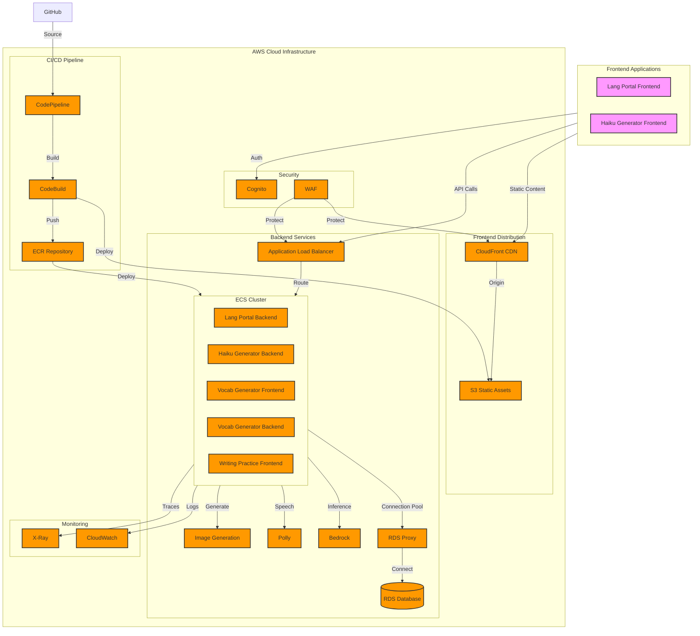

- Multi-project monorepo architecture
- Single-region deployment (us-east-1)
- Cost-optimized infrastructure

## Lang Portal
### Frontend Stack

#### Stack Specification
- **Hosting**: CloudFront + S3
  - S3 bucket for static assets
  - CloudFront distribution with HTTPS
- **Domain**: lang-portal.app-dw.net
- **Infrastructure**:
  - React SPA deployment
  - Cache policies for optimal performance
  - WAF integration for security
- **CI/CD**:
  - CodePipeline with GitHub source
  - Build and deploy stages
  - Automated invalidation

### Backend Stack
```mermaid
graph TB
    subgraph LangPortalBackendStack[Lang Portal Backend Stack]
        subgraph AWSResources[AWS Resources]
            ECS[ECS Cluster]
            ALB[Application Load Balancer]
            PROXY[RDS Proxy]
            RDS[(RDS Database)]
            style ECS fill:#FF9900,stroke:#333,stroke-width:2px,color:#333
            style ALB fill:#FF9900,stroke:#333,stroke-width:2px,color:#333
            style PROXY fill:#FF9900,stroke:#333,stroke-width:2px,color:#333
            style RDS fill:#FF9900,stroke:#333,stroke-width:2px,color:#333
        end
        
        subgraph CICDPipeline[CI/CD Pipeline]
            GH[GitHub]
            CP[CodePipeline]
            CB[CodeBuild]
            ECR[ECR Repository]
            style GH fill:#333,stroke:#fff,stroke-width:2px
            style CP fill:#FF9900,stroke:#333,stroke-width:2px,color:#333
            style CB fill:#FF9900,stroke:#333,stroke-width:2px,color:#333
            style ECR fill:#FF9900,stroke:#333,stroke-width:2px,color:#333
        end
    end
    
    GH -->|Source| CP
    CP -->|Build| CB
    CB -->|Push| ECR
    ECR -->|Deploy| ECS
    ECS -->|Connect| PROXY
    ALB -->|Route| ECS
    PROXY -->|Pool| RDS
```

#### Stack Specification
- **Compute**: ECS Fargate
  - FARGATE_SPOT for cost optimization
  - Target tracking scaling policy
    - CPU utilization target: 70%
    - Memory utilization target: 80%
  - Min capacity: 1
  - Max capacity: 4
- **Database**: Aurora PostgreSQL
  - Instance class: db.t4g.medium
  - Multi-AZ deployment for production
  - Automated backups with 7-day retention
    - Snapshot frequency: Daily
    - Transaction logs: 5-minute intervals
  - RDS Proxy with connection pooling
  - Auto-scaling storage: 20GB - 100GB
- **Storage**: S3
  - Lifecycle rules for cost optimization
  - Intelligent-Tiering for infrequent access
- **API Gateway**: REST API
  - Integrated with main domain (lang-portal.app-dw.net)
  - All API requests processed through /api/* path
- **CI/CD**: CodePipeline with GitHub source
- **Monitoring**: CloudWatch with 7-day log retention
- **Domain**: lang-portal.app-dw.internal

## Haiku Generator
### Frontend Stack
```mermaid
graph TB
    subgraph HaikuGeneratorFrontendStack[Haiku Generator Frontend Stack]
        subgraph AWSResources[AWS Resources]
            CF[CloudFront Distribution]
            S3[S3 Bucket]
            R53[Route 53]
            ACM[Certificate Manager]
            style CF fill:#FF9900,stroke:#333,stroke-width:2px,color:#333
            style S3 fill:#FF9900,stroke:#333,stroke-width:2px,color:#333
            style R53 fill:#FF9900,stroke:#333,stroke-width:2px,color:#333
            style ACM fill:#FF9900,stroke:#333,stroke-width:2px,color:#333
        end
        
        subgraph CICDPipeline[CI/CD Pipeline]
            GH[GitHub]
            CP[CodePipeline]
            CB[CodeBuild]
            style GH fill:#333,stroke:#fff,stroke-width:2px
            style CP fill:#FF9900,stroke:#333,stroke-width:2px,color:#333
            style CB fill:#FF9900,stroke:#333,stroke-width:2px,color:#333
        end
    end
    
    GH -->|Source| CP
    CP -->|Build| CB
    CB -->|Deploy| S3
    R53 -->|DNS| CF
    CF -->|Origin| S3
    CF -->|SSL| ACM
```

#### Stack Specification
- **Hosting**: CloudFront + S3
  - S3 bucket for static assets
  - CloudFront distribution with HTTPS
- **Domain**: haiku.app-dw.net
- **Infrastructure**:
  - React SPA deployment
  - Cache policies for optimal performance
  - WAF integration for security
- **CI/CD**:
  - CodePipeline with GitHub source
  - Build and deploy stages
  - Automated invalidation

### Backend Stack
```mermaid
graph TB
    subgraph HaikuGeneratorBackendStack[Haiku Generator Backend Stack]
        subgraph AWSResources[AWS Resources]
            ECS[ECS Cluster]
            ALB[Application Load Balancer]
            S3[S3 Storage]
            PROXY[RDS Proxy]
            RDS[(RDS Database)]
            BDR[Bedrock]
            PLY[Polly]
            IMG[Image Generation]
            style ECS fill:#FF9900,stroke:#333,stroke-width:2px,color:#333
            style ALB fill:#FF9900,stroke:#333,stroke-width:2px,color:#333
            style S3 fill:#FF9900,stroke:#333,stroke-width:2px,color:#333
            style PROXY fill:#FF9900,stroke:#333,stroke-width:2px,color:#333
            style RDS fill:#FF9900,stroke:#333,stroke-width:2px,color:#333
            style BDR fill:#FF9900,stroke:#333,stroke-width:2px,color:#333
            style PLY fill:#FF9900,stroke:#333,stroke-width:2px,color:#333
            style IMG fill:#FF9900,stroke:#333,stroke-width:2px,color:#333
        end
        
        subgraph CICDPipeline[CI/CD Pipeline]
            GH[GitHub]
            CP[CodePipeline]
            CB[CodeBuild]
            ECR[ECR Repository]
            style GH fill:#333,stroke:#fff,stroke-width:2px
            style CP fill:#FF9900,stroke:#333,stroke-width:2px,color:#333
            style CB fill:#FF9900,stroke:#333,stroke-width:2px,color:#333
            style ECR fill:#FF9900,stroke:#333,stroke-width:2px,color:#333
        end
    end
    
    ECS -->|Store| S3
    GH -->|Source| CP
    CP -->|Build| CB
    CB -->|Push| ECR
    ECR -->|Deploy| ECS
    ECS -->|Generate| IMG
    ECS -->|Speech| PLY
    ECS -->|Inference| BDR
    ECS -->|Connect| PROXY
    ALB -->|Route| ECS
    PROXY -->|Pool| RDS
```

#### Stack Specification
- **Compute**: ECS Fargate
  - FARGATE_SPOT for cost optimization
  - Target tracking scaling policy
    - CPU utilization target: 70%
    - Memory utilization target: 80%
  - Min capacity: 1
  - Max capacity: 4
- **Database**: Aurora PostgreSQL
  - Instance class: db.t4g.medium
  - Multi-AZ deployment for production
  - Automated backups with 7-day retention
    - Snapshot frequency: Daily
    - Transaction logs: 5-minute intervals
  - RDS Proxy with connection pooling
- **Storage**: S3
  - Image storage with lifecycle rules
  - Intelligent-Tiering enabled
- **AI Services**:
  - Amazon Polly for text-to-speech
  - Stable Diffusion on Bedrock for image generation
  - Amazon Bedrock for LLM capabilities
- **API Integration**: 
  - Integrated with main domain (haiku.app-dw.net)
  - All API requests processed through /api/* path
- **CI/CD**:
  - CodePipeline automation
  - Container builds
  - Automated deployment

## Vocab Generator
### Frontend Stack
```mermaid
graph TB
    subgraph VocabGeneratorFrontendStack[Vocab Generator Frontend Stack]
        subgraph AWSResources[AWS Resources]
            ECS[ECS Cluster]
            ALB[Application Load Balancer]
            style ECS fill:#FF9900,stroke:#333,stroke-width:2px,color:#333
            style ALB fill:#FF9900,stroke:#333,stroke-width:2px,color:#333
        end
        
        subgraph CICDPipeline[CI/CD Pipeline]
            GH[GitHub]
            CP[CodePipeline]
            CB[CodeBuild]
            ECR[ECR Repository]
            style GH fill:#333,stroke:#fff,stroke-width:2px
            style CP fill:#FF9900,stroke:#333,stroke-width:2px,color:#333
            style CB fill:#FF9900,stroke:#333,stroke-width:2px,color:#333
            style ECR fill:#FF9900,stroke:#333,stroke-width:2px,color:#333
        end
    end
    
    GH -->|Source| CP
    CP -->|Build| CB
    CB -->|Push| ECR
    ECR -->|Deploy| ECS
    ALB -->|Route| ECS
```

#### Stack Specification
- **Compute**: ECS Fargate
  - Streamlit app deployment
  - FARGATE_SPOT instances
  - Container definitions
- **Domain**: vocab.app-dw.net
- **Network**:
  - ALB for load balancing
  - Target group configuration
  - Health check endpoints
- **Monitoring**:
  - CloudWatch logs
  - Container insights
  - Custom metrics
- **CI/CD**:
  - CodePipeline with ECR
  - Container builds
  - Automated deployment

### Backend Stack
```mermaid
graph TB
    subgraph VocabGeneratorBackendStack[Vocab Generator Backend Stack]
        subgraph AWSResources[AWS Resources]
            ECS[ECS Cluster]
            ALB[Application Load Balancer]
            BDR[Bedrock]
            style ECS fill:#FF9900,stroke:#333,stroke-width:2px,color:#333
            style ALB fill:#FF9900,stroke:#333,stroke-width:2px,color:#333
            style BDR fill:#FF9900,stroke:#333,stroke-width:2px,color:#333
        end
        
        subgraph CICDPipeline[CI/CD Pipeline]
            GH[GitHub]
            CP[CodePipeline]
            CB[CodeBuild]
            ECR[ECR Repository]
            style GH fill:#333,stroke:#fff,stroke-width:2px
            style CP fill:#FF9900,stroke:#333,stroke-width:2px,color:#333
            style CB fill:#FF9900,stroke:#333,stroke-width:2px,color:#333
            style ECR fill:#FF9900,stroke:#333,stroke-width:2px,color:#333
        end
    end
    
    GH -->|Source| CP
    CP -->|Build| CB
    CB -->|Push| ECR
    ECR -->|Deploy| ECS
    ECS -->|Inference| BDR
    ALB -->|Route| ECS
```

#### Stack Specification
- **Compute**: ECS Fargate
  - FARGATE_SPOT for cost optimization
  - Target tracking scaling policy
    - CPU utilization target: 70%
    - Memory utilization target: 80%
  - Min capacity: 1
  - Max capacity: 4
  - Health monitoring
- **Database**: Aurora PostgreSQL
  - Instance class: db.t4g.medium
  - Multi-AZ deployment for production
  - Automated backups with 7-day retention
    - Snapshot frequency: Daily
    - Transaction logs: 5-minute intervals
  - RDS Proxy with connection pooling
- **AI Services**:
  - Amazon Bedrock for LLM capabilities
- **Security**:
  - VPC security
  - IAM roles and policies
  - Encryption at rest
- **Domain**: vocab.app-dw.internal
- **Networking**:
  - ALB integration
  - Route configurations
  - SSL termination
- **CI/CD**:
  - CodePipeline automation
  - Container builds
  - Automated deployment

## Writing Practice
### Frontend Stack
```mermaid
graph TB
    subgraph WritingPracticeFrontendStack[Writing Practice Frontend Stack]
        subgraph AWSResources[AWS Resources]
            ECS[ECS Cluster]
            ALB[Application Load Balancer]
            BDR[Bedrock]
            PLY[Polly]
            style ECS fill:#FF9900,stroke:#333,stroke-width:2px,color:#333
            style ALB fill:#FF9900,stroke:#333,stroke-width:2px,color:#333
            style BDR fill:#FF9900,stroke:#333,stroke-width:2px,color:#333
            style PLY fill:#FF9900,stroke:#333,stroke-width:2px,color:#333
        end
        
        subgraph CICDPipeline[CI/CD Pipeline]
            GH[GitHub]
            CP[CodePipeline]
            CB[CodeBuild]
            ECR[ECR Repository]
            style GH fill:#333,stroke:#fff,stroke-width:2px
            style CP fill:#FF9900,stroke:#333,stroke-width:2px,color:#333
            style CB fill:#FF9900,stroke:#333,stroke-width:2px,color:#333
            style ECR fill:#FF9900,stroke:#333,stroke-width:2px,color:#333
        end
    end
    
    GH -->|Source| CP
    CP -->|Build| CB
    CB -->|Push| ECR
    ECR -->|Deploy| ECS
    ALB -->|Route| ECS
    ECS -->|Inference| BDR
    ECS -->|Speech| PLY
```

#### Stack Specification
- **Compute**: ECS Fargate
  - FARGATE_SPOT for cost optimization
  - Target tracking scaling policy
    - CPU utilization target: 70%
    - Memory utilization target: 80%
  - Min capacity: 1
  - Max capacity: 4
- **AI Services**:
  - Amazon Polly for text-to-speech
  - Amazon Bedrock for LLM capabilities
- **Domain**: writing.app-dw.net
- **Network**:
  - ALB integration
  - Path-based routing
  - Health monitoring
- **Security**:
  - WAF protection
  - Security groups
  - HTTPS enabled
- **CI/CD**:
  - CodePipeline workflow
  - Container builds
  - Automated deployment

## Authentication & Authorization
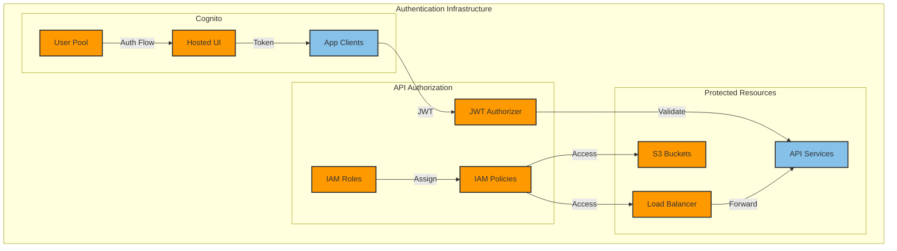

#### Stack Specification
- **User Management**: Cognito User Pools
  - Email authentication
  - Custom attributes
  - Token configuration
- **App Integration**:
  - Multiple app clients
  - OAuth 2.0 flows
  - Hosted UI customization
- **Access Control**:
  - Identity pools
  - IAM role mapping
  - Fine-grained permissions
- **Security**:
  - MFA capability
  - Password policies
  - Session management

## Monitoring & Observability
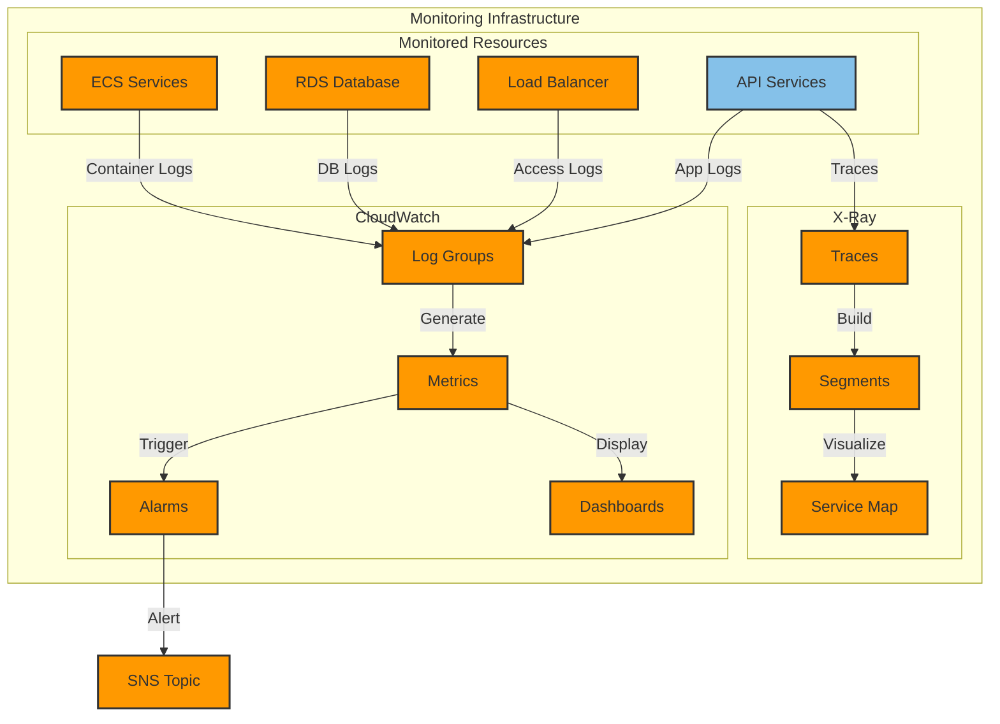

#### Stack Specification
- **Monitoring**:
  - CloudWatch metrics and logs
  - X-Ray tracing
  - OpenTelemetry integration
- **Visualization**:
  - Custom dashboards
  - Service health views
  - Cost analysis
- **Alerting**:
  - CloudWatch alarms
  - SNS notifications
  - Incident response
  - Automated alerts for:
    - 5xx errors > 5% in 5 minutes
    - CPU/Memory utilization > 85%
    - Database connection spikes
    - API latency thresholds
- **Logging**:
  - Log groups per service
  - Log retention policies
  - Log insights queries

## Network Infrastructure
### Load Balancing
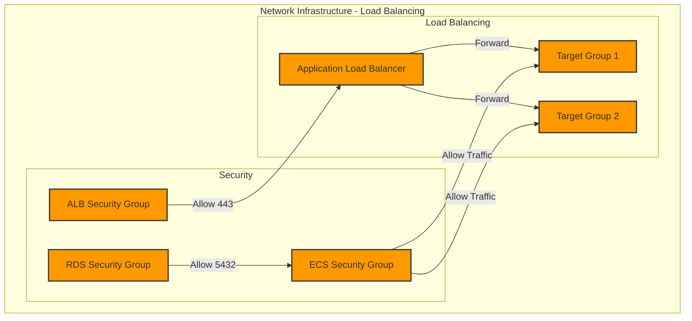

#### Stack Specification
- **Load Balancers**:
  - Application Load Balancer
  - Target groups per service
  - Health check configuration
- **Networking**:
  - VPC with public/private subnets
  - NAT Gateways for outbound
  - VPC endpoints for services
- **Routing**:
  - Route tables configuration 
  - Internet Gateway
  - Security group rules
- **DNS**:
  - Route 53 hosted zones
  - A records for services
  - Health checks

### VPC
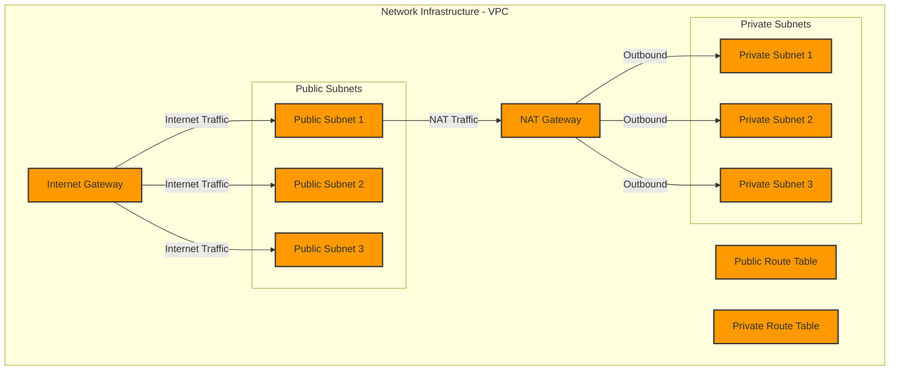
