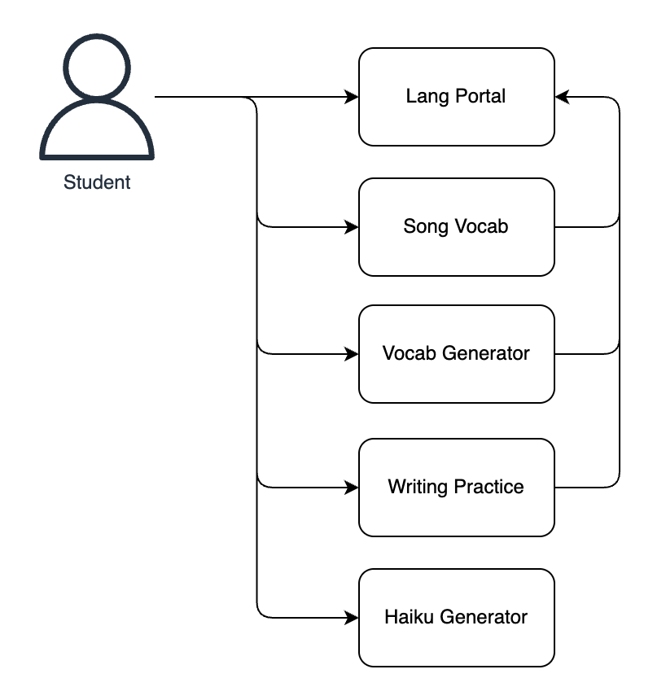

# AWS Infrastructure

This directory contains the AWS infrastructure code as well as the app code of the apps built during the bootcamp.

The goal for the final submission was to combine all the apps and host them on AWS. 

Apps built during the bootcamp:

- [Lang Portal](../lang-portal/README.md): A language learning platform that allows users to practice translating words and sentences between English and Japanese
- [Haiku Generator](../haiku-generator/README.md): A chat that assists in generating haikus and generates images and Japanese audio of the haikus
- [Vocab Generator](../opea-comps/vocab_generator/README.md): A Japanese vocab generator based on a topic
- [Writing Practice](../writing-practice/README.md): An app to practice writing in Japanese
- [Song Vocab Generator](../song-vocab/README.md): An app where the student provides the name of a Japanese song and the app returns the vocabulary of the song

## Infrastructure

To generate the infrastructure code, a specification-based approach was used. The initial specification was defined in [AWS-Tech-Specs.md](AWS-Tech-Specs.md). A second and very verbose specification was defined in [AWS-Tech-Specs-v2.md](AWS-Tech-Specs-v2.md) with the help of AI. A more condensed version of the specification was defined in [AWS-Tech-Specs-v3.md](AWS-Tech-Specs-v3.md). A mix of v2 and v3 was used to generate the infrastructure code.

The apps that got successfully deployed were the lang portal and the haiku generator.

## Deployed Apps

### Lang Portal

### Haiku Generator

## Diagrams

Conceptual Architecture Diagram

[Conceptual Architecture Diagram file](https://app.diagrams.net/?title=conceptual-architecture-diagram#Uhttps%3A%2F%2Fraw.githubusercontent.com%2Fdanielwohlgemuth%2Ffree-genai-bootcamp-2025%2Frefs%2Fheads%2Fmain%2Faws%2Fassets%2Fconceptual-architecture-diagram.drawio)

AWS High-Level Architecture Diagram

[AWS High-Level Architecture Diagram file](https://app.diagrams.net/?title=aws-high-level-architecture-diagram#Uhttps%3A%2F%2Fraw.githubusercontent.com%2Fdanielwohlgemuth%2Ffree-genai-bootcamp-2025%2Frefs%2Fheads%2Fmain%2Faws%2Fassets%2Faws-high-level-architecture-diagram.drawio)
