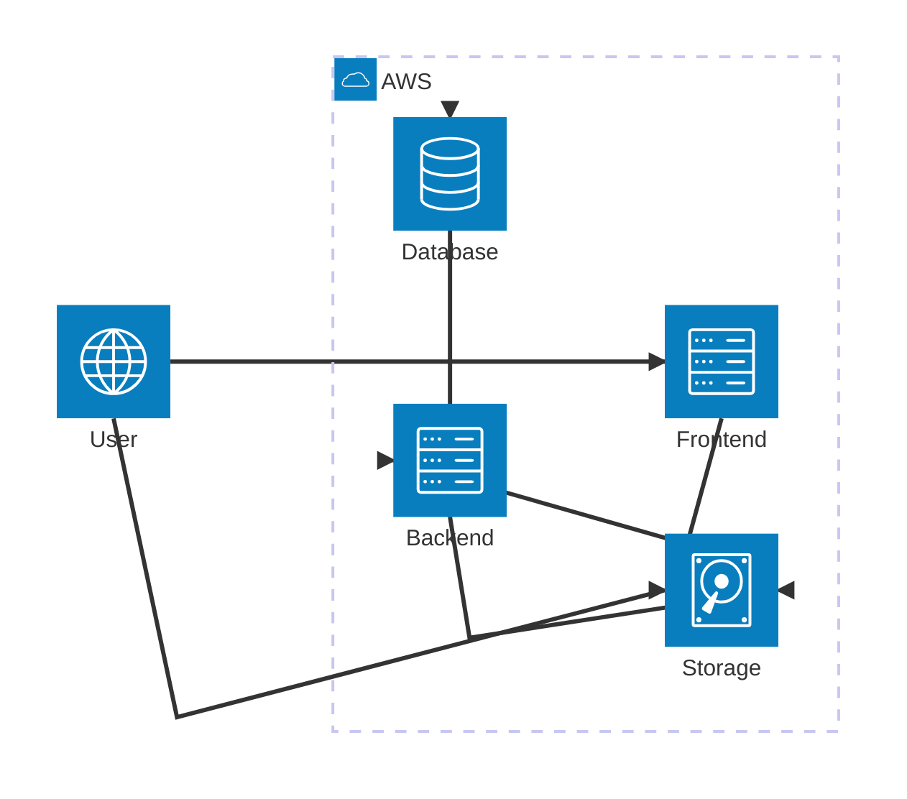
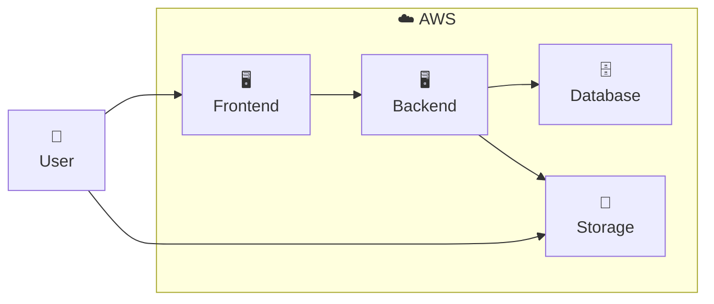

# Mermaid Diagrams

## Architecture

```mermaid
architecture-beta
    group aws(cloud)[AWS]

    service web(internet)[User]
    service frontend(server)[Frontend] in aws
    service backend(server)[Backend] in aws
    service database(database)[Database] in aws
    service storage(disk)[Storage] in aws

    web:R --> L:frontend
    frontend:B --> L:backend
    backend:B --> T:database
    backend:B --> R:storage
    web:B --> L:storage
```

## Flowchart

```mermaid
flowchart LR
    user@{ label: "👤\nUser" }
    frontend@{ label: "🖥️\nFrontend" }
    backend@{ label: "🖥️\nBackend" }
    database@{ label: "🗄️\nDatabase" }
    storage@{ label: "📂\nStorage"}

    user --> frontend
    user --> storage
    subgraph "☁️ AWS"
        frontend --> backend
        backend --> database
        backend --> storage
    end
```
