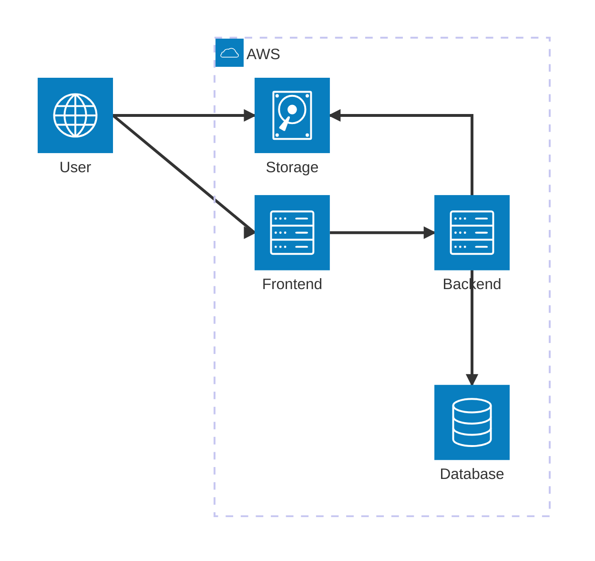

```mermaid
architecture-beta
    group aws(cloud)[AWS]

    service web(internet)[User]
    service frontend(server)[Frontend] in aws
    service backend(server)[Backend] in aws
    service database(database)[Database] in aws
    service storage(disk)[Storage] in aws

    web:R --> L:frontend
    frontend:R --> L:backend
    backend:B --> T:database
    backend:B --> R:storage
    web:R --> L:storage
```
