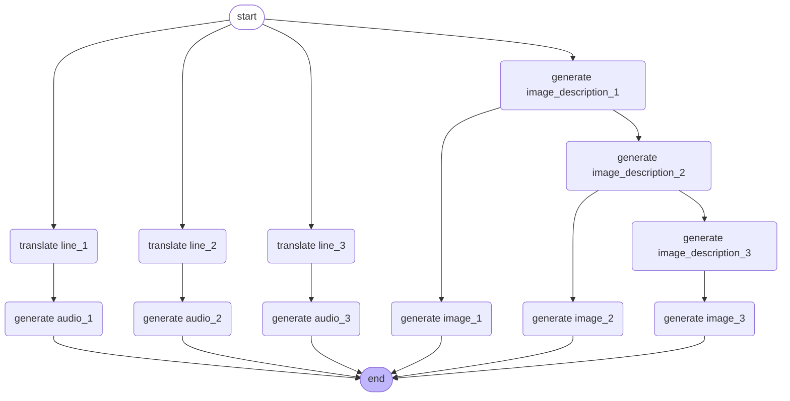

# Haiku Generator - Backend Technical Specifications

The Haiku Generator is an application that creates haikus based on user-provided topics through an interactive chatbot. Users can select a topic, and the application generates a haiku in English. Upon approval, it produces three images and audio files for each line of the haiku, along with a Japanese translation and corresponding audio.

This document outlines the technical specifications necessary for implementing the backend features, including architecture, database schema, and API endpoints.

## Business Goals

- User Interaction: Provide an engaging chatbot experience that allows users to easily select topics for haiku generation.
- Haiku Generation: Automatically generate a haiku in English based on the user’s chosen topic and facilitate user feedback for refinement.
- Multimedia Output: Upon user approval, generate three images and audio files corresponding to each line of the haiku.
- Translation: Translate the generated haiku into Japanese and produce audio based on this translation.
- Data Management: Store haiku information, user interactions, and multimedia outputs in a database.
- Rate Limiting: Implement a system that allows users to have only one haiku in progress at a time.

## Architecture

The architecture of the Haiku Generator application is designed to facilitate seamless interaction between users and the system while ensuring efficient processing of haiku generation and multimedia output. The application utilizes a microservices architecture, with the following key components:

1. Chatbot Interface
	- Functionality: Serves as the primary interface for user interaction, allowing users to select topics and provide feedback on generated haikus.

2. Haiku Generation Service
	- Description: Utilizes the LangChain framework to generate haikus based on user input. This service is responsible for:
		- Generating haikus in English.
		- Translating haikus into Japanese.

3. Multimedia Generation Service
	- Image Generation:
		- Utilizes the Stable Diffusion model from Hugging Face to create images corresponding to each line of the haiku.
		- The images are generated based on descriptions derived from the haiku.
	- Audio Generation:
		- Employs the Coqui TTS framework to produce audio files for both English and Japanese versions of the haiku.

4. Database Management
	- SQLite Database:
		- Stores information about each haiku, including its status, generated multimedia, and user interactions.
		- Ensures data integrity and efficient retrieval.

5. Storage Service
	- MinIO:
		- Used for storing generated images and audio files, organized by haiku ID for easy access.

6. API Layer
	- FastAPI:
		- Exposes the following endpoints to facilitate user interaction:
			- POST /chat/{id}: For user interaction with the chatbot.
			- GET /chat/{id}/history: To retrieve chat history.
			- GET /haiku: To list all haiku IDs and their statuses.
			- GET /haiku/{id}: To retrieve a specific haiku.
			- DELETE /haiku/{id}: To delete a haiku and its associated data.

7. Workflow Diagram
	- A mermaid diagram illustrating the flow of operations, from user input to haiku generation and multimedia output, is provided below:

## Technical Specifications

The Haiku Generator application leverages various technologies and frameworks to ensure efficient functionality. Below are the key technical specifications:

1. Frameworks and Libraries
	- LangChain: Used for generating haikus and translating text.
	- LangGraph: Used to define the workflow for the multimedia generation service.
	- FastAPI: Serves as the web framework for building the API endpoints.
	- Coqui TTS: Utilized for text-to-speech functionality to generate audio files for the haikus.
	- Stable Diffusion: A model from Hugging Face for generating images based on textual descriptions.

2. Database
	- SQLite:
		- Purpose: Stores haiku information, user interactions, and multimedia outputs.
		- Schema:
			- Haiku Table:
				- `haiku_id`: Primary key (36 characters).
				- `status`: Current status of the haiku ("in progress", "completed", "failed", defaults to "in progress").
				- `error_message`: Error message if applicable (limited to 1000 characters).
				- `haiku_lines_en`: Three lines of the haiku in English (255 characters each).
				- `haiku_lines_ja`: Three lines of the haiku in Japanese (255 characters each).
				- `image_description_1`: Description for the first image (1000 characters).
				- `image_description_2`: Description for the second image (1000 characters).
				- `image_description_3`: Description for the third image (1000 characters).
				- `image_link_1`: Link to the first generated image (255 characters).
				- `image_link_2`: Link to the second generated image (255 characters).
				- `image_link_3`: Link to the third generated image (255 characters).
				- `audio_link_1`: Link to the first generated audio file (255 characters).
				- `audio_link_2`: Link to the second generated audio file (255 characters).
				- `audio_link_3`: Link to the third generated audio file (255 characters).
			- Chat History Table:
				- `id`: Primary key (autoincrement).
				- `haiku_id`: Foreign key linking to the Haiku table.
				- `role`: Role of the participant ("user" or "chatbot").
				- `message`: The message content (limited to 1000 characters).

3. Storage
	- MinIO:
		- Purpose: Object storage for images and audio files.
		- Organization:
			- Bucket name is `haiku`.
			- Folder name corresponds to the haiku ID.
			- Object names follow the format: image-1, audio-1, etc

4. API Endpoints
	- POST /chat/{id}: Interact with the chatbot.
	- GET /chat/{id}/history: Retrieve chat history.
	- GET /haiku: List all haiku IDs and their statuses.
	- GET /haiku/{id}: Retrieve a specific haiku based on its ID.
	- DELETE /haiku/{id}: Delete a haiku and its associated data.

5. Rate Limiting
	- Users can only have one haiku in progress at any given time to prevent overlapping requests and ensure a smooth user experience.

6. Error Handling
	- The application will provide error messages for various failure scenarios, including:
		- Haiku generation failures.
		- Multimedia generation errors.
		- Database access issues.

