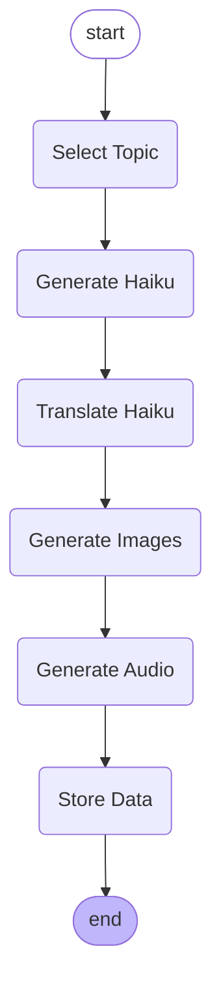

# Haiku Generator

Generate haikus based on a topic provided by the user.

## Introduction

The Haiku Generator is a project that aims to create a chatbot-powered application for generating haikus based on user-provided topics. This document outlines the project's objectives, architecture, and technical specifications.

### Key Terms

* Haiku: A traditional form of Japanese poetry consisting of three lines with a syllable count of 5-7-5.
* Chatbot: A computer program designed to simulate conversation with human users.
* Microservices: A software development technique that structures an application as a collection of small, independent services.

## Business Goals

The Haiku Generator aims to provide a user-friendly chatbot interface for generating haikus based on user-provided topics. The application should:

* Allow users to interact with the chatbot to select a topic and generate a haiku.
* Provide users with a haiku in English, along with three corresponding images and audio files.
* Enable users to refine their topic selection and regenerate the haiku.
* Store user chat history and haiku data for future reference.

## Architecture Overview

The Haiku Generator architecture consists of a megaservice and several microservices.

### Megaservice

The megaservice is responsible for managing user interactions, generating haikus, and coordinating the workflow.

### Microservices

The microservices include:

* Haiku Generation Service: responsible for generating haikus based on user-provided topics.
* Image Generation Service: responsible for generating images based on the haiku lines.
* Audio Generation Service: responsible for generating audio files based on the haiku lines.
* Translation Service: responsible for translating the haiku from English to Japanese.

## Workflow Diagram

The workflow diagram illustrates the sequence of events in the Haiku Generator application.



## Technical Specifications

### Frameworks and Tools

* OPEA (Open Platform for Enterprise AI) framework
* LangChain for haiku generation and translation
* LangGraph for workflow management
* Hugging Face Transformers for image and audio generation
* SQLite for data storage
* FastAPI for API development

### Haiku Generation Process

The haiku generation process involves the following steps:

1. User selects a topic and provides input to the chatbot.
2. The Haiku Generation Service generates a haiku based on the user-provided topic.
3. The Translation Service translates the haiku from English to Japanese.
4. The Image Generation Service generates images based on the haiku lines.
5. The Audio Generation Service generates audio files based on the haiku lines.

### Image and Audio Generation

The image and audio generation processes involve the following steps:

1. The Image Generation Service generates images based on the haiku lines.
2. The Audio Generation Service generates audio files based on the haiku lines.

#### Code Examples

```python
import torch
from diffusers import StableDiffusion3Pipeline
import os

HUGGINGFACEHUB_API_TOKEN = os.getenv("HUGGINGFACEHUB_API_TOKEN", None)

pipe = StableDiffusion3Pipeline.from_pretrained("stabilityai/stable-diffusion-3.5-medium", token=HUGGINGFACEHUB_API_TOKEN)

device = "cuda" if torch.cuda.is_available() else "cpu"
pipe = pipe.to(device)

image = pipe(
    """image prompt""",
    num_inference_steps=5,
    guidance_scale=4.5,
).images[0]
image.save(f"{STORAGE_URL}/haiku/{haiku_id}/image-1.png")
```

```python
import torch
from TTS.api import TTS

device = "cuda" if torch.cuda.is_available() else "cpu"

tts = TTS("tts_models/multilingual/multi-dataset/xtts_v2").to(device)
tts.tts_to_file(
    text="japanese text",
    speaker="Chandra MacFarland",
    language="ja",
    file_path=f"{STORAGE_URL}/haiku/{haiku_id}/audio-1.wav"
)
