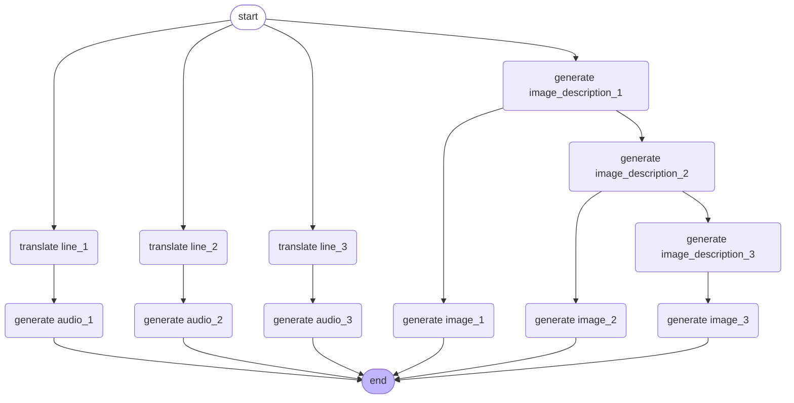

# Haiku Generator

Generate haikus based on a topic provided by the user.

## Introduction

The Haiku Generator project aims to provide a chatbot that interacts with users to generate haikus based on their chosen topics. The chatbot will also generate corresponding images and audio for each line of the haiku, enhancing the user experience.

## Business Goals

- Provide a chatbot for user interaction.
- Help users select a topic for haiku generation.
- Generate a haiku based on the selected topic in English.
- If the user agrees with the haiku, generate three images and audios corresponding to each line.
- If the user disagrees, assist in refining the topic.
- Translate the haiku into Japanese and generate audio based on the Japanese version.

## Architecture Overview

The app consists of an agentic workflow with two tools available:
1. **Image and Audio Generation Tool**: 
   - Function that takes the haiku as input and returns the haiku ID.
2. **Completion Check Tool**: 
   - Function that takes the haiku ID as input and returns the status of the generation process.

### Workflow Diagram



## Technical Specifications

### Frameworks and Libraries
- **OPEA**: Open Platform for Enterprise AI framework.
- **LangChain**: For haiku generation and translation.
- **LangGraph**: To build the flow for image and audio generation.

### Services Overview
- **Megaservice**: Haiku generation.
- **Microservices**: Chatbot, image generation, audio generation.

### Data Storage
- **SQLite Schema**:
  - haiku id (primary key)
  - status ("in progress", "completed", "failed")
  - error message (if any)
  - haiku lines (English and Japanese)
  - image descriptions and links
  - audio links

- **MinIO Storage Structure**:
  - Bucket name: haiku
  - Folder name: haiku id
  - Object names: image-1, audio-1, etc.

## Workflow Steps

1. **User selects a topic** for the haiku.
2. **Chatbot generates a haiku** based on the topic.
3. **Translate each line** of the haiku into Japanese.
4. **Generate audio** for each line in Japanese.
5. **Create image descriptions** for each line.
6. **Generate images** based on the descriptions.
7. **Store the haiku, images, and audio** in the database and MinIO.

## Code Examples

### Haiku Generation
```python
# Example code for generating a haiku
def generate_haiku(topic):
    # Code to generate haiku based on the topic
    haiku = langchain.generate_haiku(topic)
    return haiku
```

### Image Generation
```python
import torch
from diffusers import StableDiffusion3Pipeline
import os

HUGGINGFACEHUB_API_TOKEN = os.getenv("HUGGINGFACEHUB_API_TOKEN", None)

pipe = StableDiffusion3Pipeline.from_pretrained("stabilityai/stable-diffusion-3.5-medium", token=HUGGINGFACEHUB_API_TOKEN)

device = "cuda" if torch.cuda.is_available() else "cpu"
pipe = pipe.to(device)

image = pipe(
    """image prompt""",
    num_inference_steps=5,
    guidance_scale=4.5,
).images[0]
image.save(f"{STORAGE_URL}/haiku/{haiku_id}/image-1.png")
```

### Audio Generation
```python
import torch
from TTS.api import TTS

device = "cuda" if torch.cuda.is_available() else "cpu"

tts = TTS("tts_models/multilingual/multi-dataset/xtts_v2").to(device)
tts.tts_to_file(
    text="japanese text",
    speaker="Chandra MacFarland",
    language="ja",
    file_path=f"{STORAGE_URL}/haiku/{haiku_id}/audio-1.wav"
)
```

## API Endpoints

| Method | Path               | Description                                   |
|--------|--------------------|-----------------------------------------------|
| POST   | /chat/{id}         | User interacts with the chatbot               |
| GET    | /chat/{id}/history  | Retrieve chat history for the user            |
| GET    | /haiku             | Get all haiku ids, text, and status          |
| GET    | /haiku/{id}       | Get haiku based on the haiku id              |
| DELETE | /haiku/{id}       | Delete the haiku and associated data          |

## Rate Limiting and User Interaction

- Users can only have one haiku in progress at a time.
- Once a haiku is complete, users can start a new one but cannot interact with the old one except to delete it.

## Future Enhancements

- Consider adding support for multiple languages for haiku generation.
- Implement user feedback mechanisms to improve haiku quality.
- Explore additional features like sharing haikus on social media.
