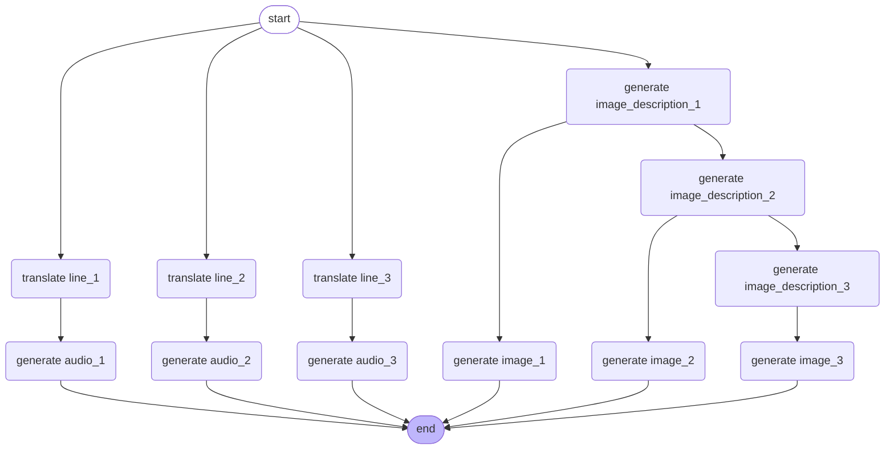

# Haiku Generator - Backend Technical Specifications

The Haiku Generator project aims to provide a chatbot that interacts with users to generate haikus based on their chosen topics. The chatbot will also generate corresponding images and audio for each line of the haiku.

## Business Goals

- Provide a chatbot for user interaction.
- Help users select a topic for haiku generation.
- Generate a haiku based on the selected topic in English.
- If the user agrees with the haiku, generate three images and audios corresponding to each line.
- If the user disagrees, assist in refining the topic.
- Translate the haiku into Japanese and generate audio based on the Japanese version.
- Store user chat history and haiku data for future reference.

## Architecture Overview

The application utilizes a microservices architecture, with the following key components:

1. **Haiku Generation Service**: Utilizes the LangChain framework to generate haikus based on user input. This service is responsible for:
	- Generating haikus in English.
	- Translating haikus into Japanese.
	- Calling available tools:
		- **Update Haiku Tool**: Function that takes the haiku and haiku ID as inputs and updates the haiku in the database.
		- **Image and Audio Generation Tool**: Function that takes the haiku ID as input and starts the multimedia generation process.
		~~- **Completion Check Tool**: Function that takes the haiku ID as input and returns the status of the generation process.~~ The media generation service ended up being synchronous and this can also be achieved by calling an API endpoint.

2. **Multimedia Generation Service**: Utilizes the following tools to generate images and audio files:
	- Image Generation: Creates images corresponding to each line of the English haiku. The images are generated based on descriptions derived from the haiku.
	- Audio Generation: Generates audio files for the Japanese version of the haiku.

3. **Database Management Service**: Stores information about each haiku, including its status, generated multimedia, and user interactions.

4. **Storage Service**: Stores generated images and audio files.

### Workflow Diagram

The workflow diagram illustrates the sequence of events of the multimedia generation service.



## Technical Specifications

### Haiku Generation Process
1. **User selects a topic** for the haiku.
2. **Chatbot generates a haiku** based on the topic.
3. **Translate each line** of the haiku into Japanese.
4. **Generate audio** for each line in Japanese.
5. **Create image descriptions** for each line.
6. **Generate images** based on the descriptions.
7. **Store the haiku, images, and audio** in the database and storage service.

### Frameworks, Libraries, and Tools
- OPEA (Open Platform for Enterprise AI) framework: Used for the overall architecture.
- LangChain: Used for generating haikus and translating text.
- LangGraph: Used to define the workflow for the multimedia generation service.
- FastAPI: Serves as the web framework for building the API endpoints.
- Coqui TTS: Utilized for text-to-speech functionality to generate audio files for the haikus.
- Stable Diffusion: A model from Hugging Face for generating images based on textual descriptions.
- MinIO: Object storage for images and audio files.
- SQLite: Database for storing haiku information, user interactions, and multimedia outputs.
- Ollama: Hosts the LLM for generating haikus, translating text, and generating image descriptions.

### Database Schema:
- Haiku Table:
	- `haiku_id`: Primary key (36 characters).
	- `status`: Current status of the haiku ("new", "in progress", "completed", "failed", defaults to "new").
	- `error_message`: Error message if applicable (limited to 1000 characters).
	- `haiku_line_en_1`: First line of the haiku in English (255 characters).
	- `haiku_line_en_2`: Second line of the haiku in English (255 characters).
	- `haiku_line_en_3`: Third line of the haiku in English (255 characters).
	- `haiku_line_ja_1`: First line of the haiku in Japanese (255 characters).
	- `haiku_line_ja_2`: Second line of the haiku in Japanese (255 characters).
	- `haiku_line_ja_3`: Third line of the haiku in Japanese (255 characters).
	- `image_description_1`: Description for the first image (1000 characters).
	- `image_description_2`: Description for the second image (1000 characters).
	- `image_description_3`: Description for the third image (1000 characters).
	- `image_link_1`: Link to the first generated image (255 characters).
	- `image_link_2`: Link to the second generated image (255 characters).
	- `image_link_3`: Link to the third generated image (255 characters).
	- `audio_link_1`: Link to the first generated audio file (255 characters).
	- `audio_link_2`: Link to the second generated audio file (255 characters).
	- `audio_link_3`: Link to the third generated audio file (255 characters).
- Chat History Table:
	- `chat_id`: Primary key (autoincrement).
	- `haiku_id`: Foreign key linking to the Haiku table.
	- `role`: Role of the participant ("user" or "chatbot").
	- `message`: The message content (limited to 1000 characters).

### Storage Structure
- Bucket name: haiku
- Folder name: haiku id
- Object names: image-1, audio-1, etc.

### API Endpoints
- `POST /chat/{haiku_id}`: Interact with the chatbot.
	- Request Body: `{ "message": "string" }`
	- Response: `{ "chat_id": "string", "message": "string", "haiku": { "haiku_line_en_1": "string", "haiku_line_en_2": "string", "haiku_line_en_3": "string", "status": "string", "error_message": "string" } }`
- `GET /chat/{haiku_id}/history`: Retrieve chat history.
	- Response: `{ "messages": [ { "chat_id": "string", "role": "string", "message": "string" } ] }`
- `GET /haiku`: List all haiku IDs and their statuses.
	- Response: `{ "haikus": [ { "haiku_id": "string", "status": "string", "error_message": "string" } ] }`
- `GET /haiku/{haiku_id}`: Retrieve a specific haiku based on its ID.
	- Response: `{ "haiku": { ... } }`
- `DELETE /haiku/{haiku_id}`: Delete a haiku and its associated data.

### Services

The following services are expected to be available, and should be configurable via environment variables.

- **MinIO**: Available at `http://localhost:9000`
- **Ollama**: Available at `http://localhost:11434`

### Rate Limiting and User Interaction
- Users can only have one haiku in progress at a time.
- Once a haiku is complete, users can start a new one but cannot interact with the old one except to delete it.

### Error Handling
- The application will provide error messages for various failure scenarios, including:
	- Haiku generation failures.
	- Multimedia generation errors.
	- Database access issues.

## Code Examples

### Image Generation
```python
import torch
from diffusers import StableDiffusion3Pipeline
import os

HUGGINGFACEHUB_API_TOKEN = os.getenv("HUGGINGFACEHUB_API_TOKEN", None)

pipe = StableDiffusion3Pipeline.from_pretrained("stabilityai/stable-diffusion-3.5-medium", token=HUGGINGFACEHUB_API_TOKEN)

device = "cuda" if torch.cuda.is_available() else "cpu"
pipe = pipe.to(device)

image = pipe(
    """image prompt""",
    num_inference_steps=5,
    guidance_scale=4.5,
).images[0]
image.save(f"{STORAGE_URL}/haiku/{haiku_id}/image-1.png")
```

### Audio Generation
```python
import torch
from TTS.api import TTS

device = "cuda" if torch.cuda.is_available() else "cpu"

tts = TTS("tts_models/multilingual/multi-dataset/xtts_v2").to(device)
tts.tts_to_file(
    text="japanese text",
    speaker="Chandra MacFarland",
    language="ja",
    file_path=f"{STORAGE_URL}/haiku/{haiku_id}/audio-1.wav"
)
```
