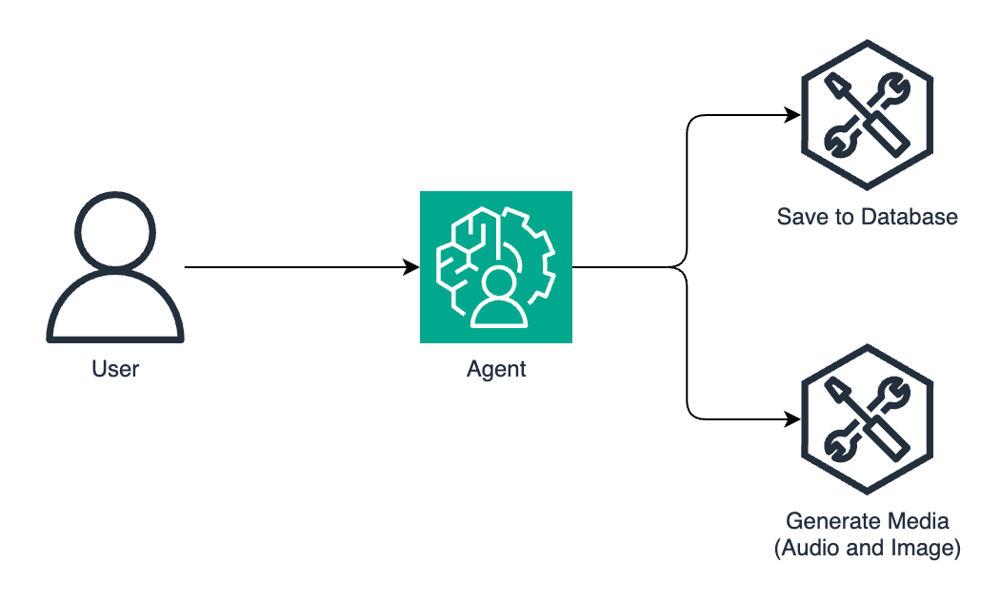
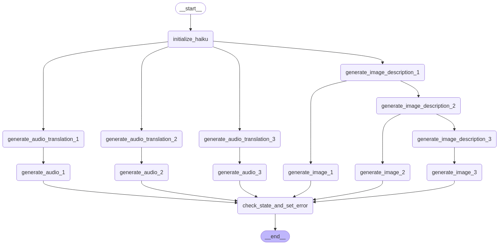
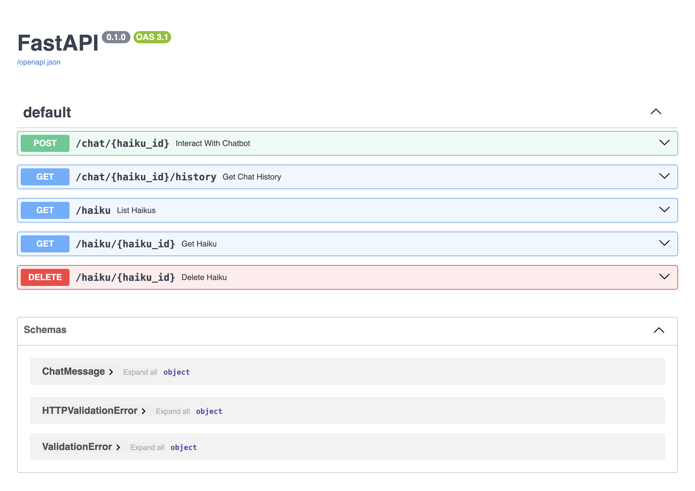

# Haiku Generator

This project provides a chatbot for user interaction to generate haikus and a corresponding image and audio for each line of the haiku.

## What is a Haiku?

A haiku is a traditional Japanese poem with the following format:
- Three lines
- Syllable pattern:
    - 5 syllables in the first line
    - 7 syllables in the second line
    - 5 syllables in the third line

Example:
```text
Silent autumn breeze
Golden leaves drift to the ground
Whispers of the past
```

## Findings

- Making an async call from a synchronous context is not that simple in Python. I tried making the media generation run in the background since it was a long-running process. It's not as easy as a fire-and-forget in JavaScript. I ended up making it synchronous after multiple failed attempts to make it asynchronous with the help of chatbots.
- Running a text-to-image model can consume a lot of RAM and slows the development feedback loop. I tried using `stable-diffusion-3.5-medium`. It consumed around 30GB of RAM, took several minutes just to load, and took a lot of time to generate the image, depending on the amount of inference steps. Generating an image with 40 steps took ~30 minutes. I ended up using `amused-256` instead. The model is much faster (seconds to a few minutes) and consumes less RAM (~3GB) but the quality is not as good.
- There aren't a lot of options when it comes to generating Japanese voice. I ended up using the `coqui-tts` library and the `XTTS-v2` model with reasonable results.
- It helps creating small proof-of-concept projects to test new technologies and find the configuration that works best before including it in a larger project, where it gets more complex to debug.

## Backend

[Backend Tech Specs](Backend-Tech-Specs.md)

[Backend Setup](backend/README.md)

### Agentic Workflow

An agentic workflow is a chatbot with which users can interact and where the chatbot can decide to use the tools available to it, in this case, to save the haiku and start generating the media content.



[Agentic Workflow file](https://app.diagrams.net/?title=agentic-workflow#Uhttps%3A%2F%2Fraw.githubusercontent.com%2Fdanielwohlgemuth%2Ffree-genai-bootcamp-2025%2Frefs%2Fheads%2Fmain%2Fhaiku-generator%2Fassets%2Fagentic-workflow.drawio)

### Media Generation Workflow

The media generation workflow has two parts: generate an image and an audio for each line of the haiku.

Generating the image can be broken down into two steps: generate an image description and generate the image. The image description is generated sequentially with the intention to make the descriptions be consistent, while the image is generated in parallel.

Generating the audio can also be broken down into two steps: generate a translation and generate the audio, both in parallel since there is no dependency between each line.



[Media Workflow file](assets/media.mermaid)

### Backend API


