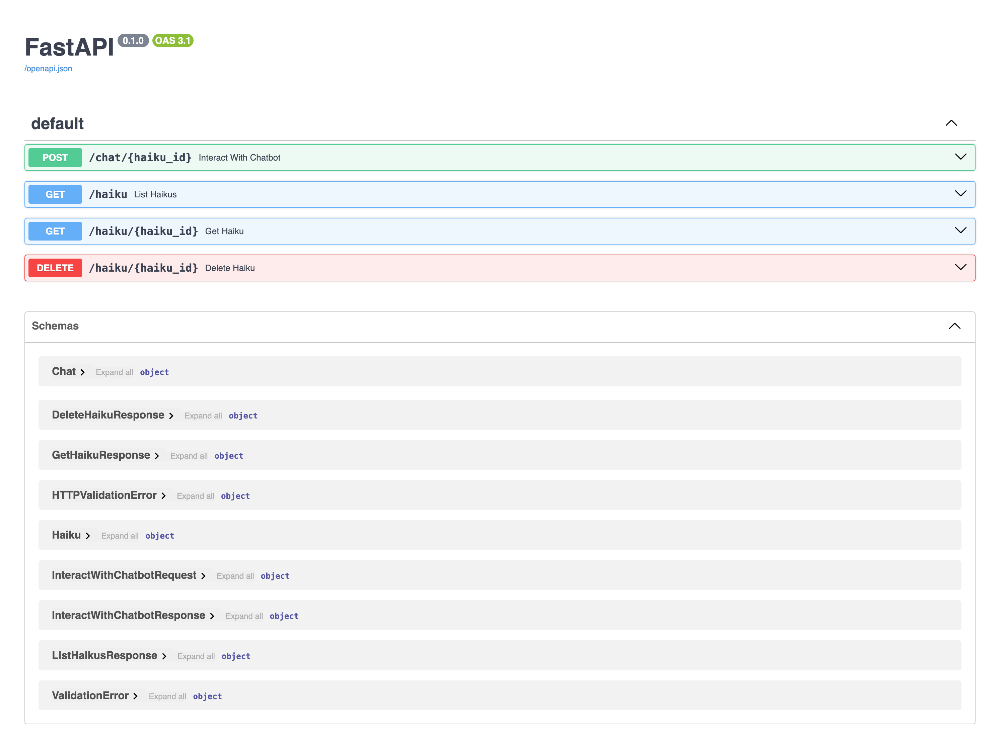

# Haiku Generator

This project provides a chatbot for user interaction to generate haikus and generate an image and audio for each line of the haiku.

## What is a Haiku?

A haiku is a traditional Japanese poem with the following format:
- Three lines
- Syllable pattern:
    - 5 syllables in the first line
    - 7 syllables in the second line
    - 5 syllables in the third line

Example:
```text
Silent autumn breeze
Golden leaves drift to the ground
Whispers of the past
```

## Backend

[Backend Tech Specs](Backend-Tech-Specs.md)

Backend API



Agentic Workflow


[Agentic Workflow file](https://app.diagrams.net/?title=agentic-workflow#Uhttps%3A%2F%2Fraw.githubusercontent.com%2Fdanielwohlgemuth%2Ffree-genai-bootcamp-2025%2Frefs%2Fheads%2Fmain%2Fhaiku-generator%2Fassets%2Fagentic-workflow.drawio)

Media Generation Workflow


[Media Workflow file](assets/media.mermaid)

### Setup

1. Create a virtual environment:
```bash
python3 -m venv venv
source venv/bin/activate
```
2. Install the required packages:
```bash
pip install -r requirements.txt
```

3. Setup the database:
```bash
python database.py
```

4. Start the FastAPI server:
```bash
uvicorn main:app --reload
```

### Usage

```bash
docker-compose up -d --build
```
