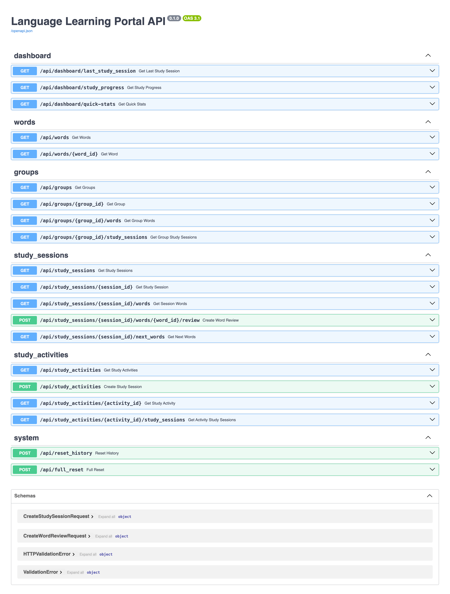

# Language Learning Portal Backend

A FastAPI-based backend service for the language learning portal.

Backend API Docs



## Setup

### Prerequisites
- Python 3.8 or higher
- pip (Python package installer)

### Installation

1. Create a virtual environment:
```bash
python3 -m venv venv
```

2. Activate the virtual environment:
```bash
source venv/bin/activate
```

3. Install the requirements:
```bash
pip install -r requirements.txt
```

### Database Setup

Before running the server for the first time:

Run the complete setup with:
```bash
invoke setup
```

Or run individual tasks:
```bash
invoke init-db
invoke run-migrations
invoke seed-data
```

## Running the Server

You can run the server in two ways:

1. Using invoke:
```bash
invoke run-server
```

2. Using invoke with auto-reload (recommended for development):
```bash
invoke dev-server
```

The server will start on `http://localhost:8000`.

## API Documentation

Once the server is running, you can access:
- Swagger UI documentation at `http://localhost:8000/docs`
- ReDoc documentation at `http://localhost:8000/redoc`

## Development Notes

- The virtual environment needs to be activated each time you open a new terminal:
```bash
source venv/bin/activate
```

- To deactivate the virtual environment:
```bash
deactivate
```

- To see what packages are installed:
```bash
pip list
```

## Project Structure

```
backend_python/
├── cmd/
│   └── server/         # Server entry point
├── internal/
│   ├── models/         # Data structures and database operations
│   ├── handlers/       # HTTP handlers organized by feature
│   └── service/        # Business logic
├── db/
│   ├── migrations/     # Database migrations
│   └── seeds/          # Seed data files
├── dodo.py            # Task definitions
├── requirements.txt   # Python dependencies
└── words.db          # SQLite database
```

## API Endpoints

The API provides endpoints for:
- Dashboard statistics
- Word management
- Group management
- Study sessions
- Study activities
- System management

For detailed API documentation, please refer to the Swagger UI (`/docs`) when the server is running. 