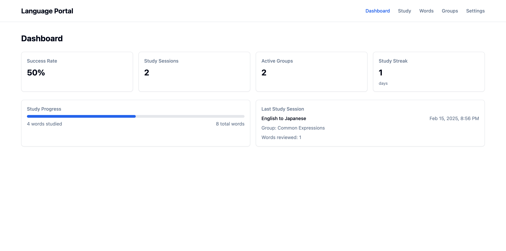
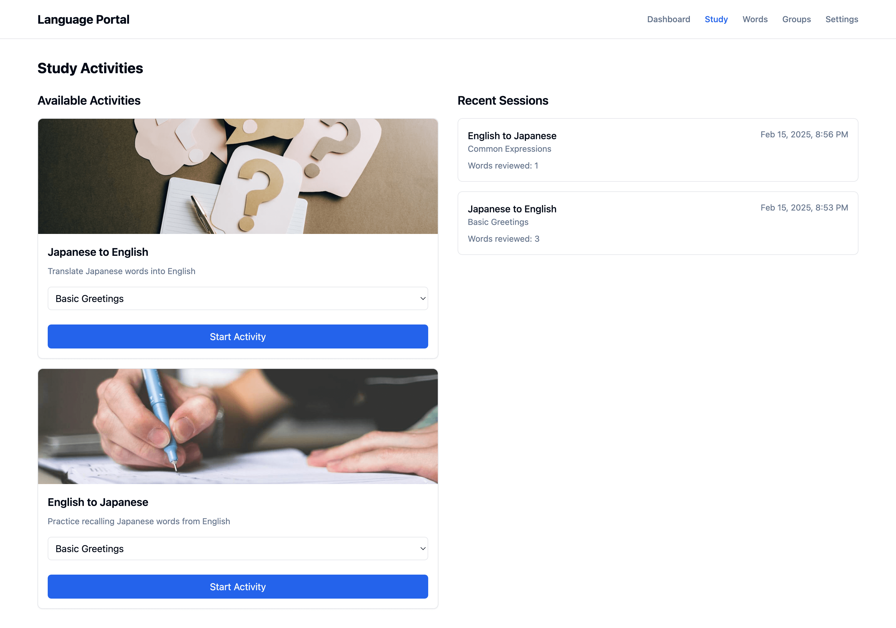
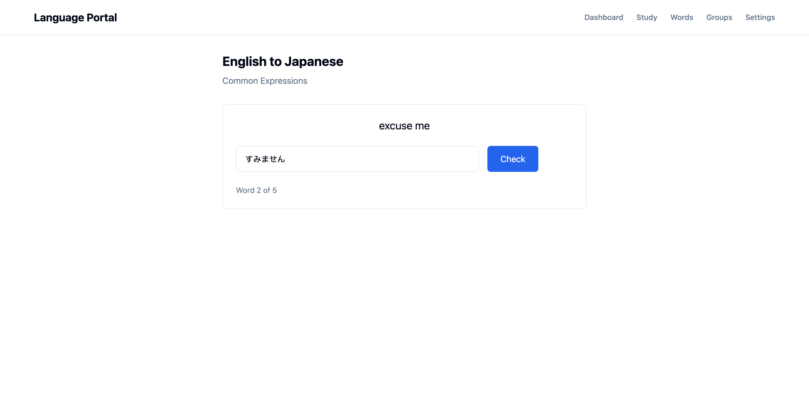
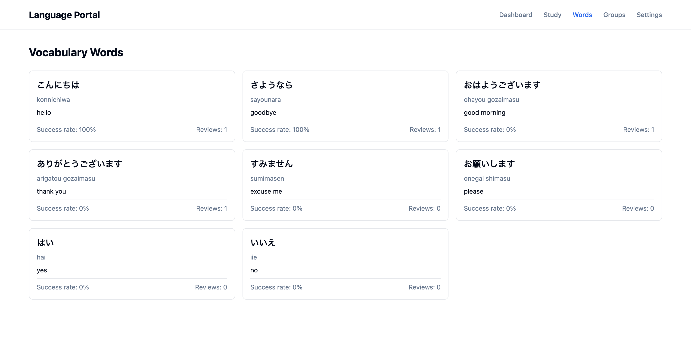
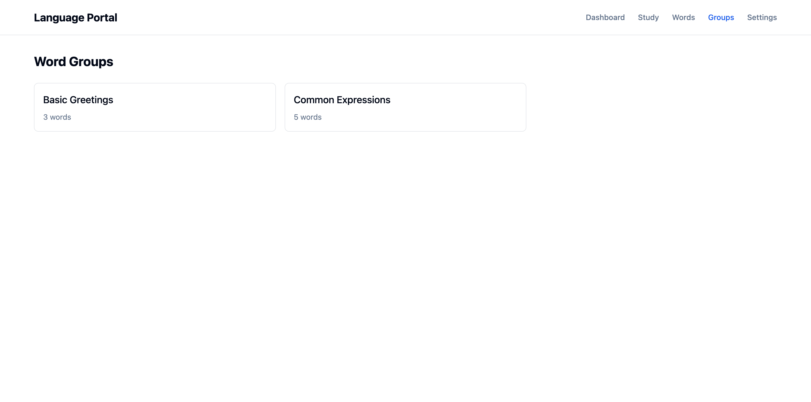

# Language Portal Frontend

A modern web application for language learning, built with React, TypeScript, and Tailwind CSS.

Dashboard



Study Activity



Study Session



Words



Word Groups



## Features

- Dashboard with learning progress and statistics
- Interactive study sessions
- Vocabulary management
- Word groups organization
- Study history tracking

## Prerequisites

- Node.js (v18 or higher)
- npm or yarn
- Backend server running (see backend documentation)

## Getting Started

1. Clone the repository:
```bash
git clone <repository-url>
cd lang-portal/frontend
```

2. Install dependencies:
```bash
npm install
# or
yarn install
```

3. Create a `.env` file in the project root:
```env
VITE_API_BASE_URL=http://localhost:8000/api
```

4. Start the development server:
```bash
npm run dev
# or
yarn dev
```

The application will be available at `http://localhost:5173`

## Project Structure

```
frontend/
├── src/
│   ├── components/    # Reusable UI components
│   │   ├── dashboard/ # Dashboard-specific components
│   │   ├── groups/    # Group management components
│   │   ├── layout/    # Layout components
│   │   ├── study/     # Study-related components
│   │   ├── ui/        # UI components
│   │   └── words/     # Word management components
│   ├── lib/           # Utility functions
│   ├── pages/         # Page components
│   ├── services/      # API and other services
│   └── types/         # TypeScript type definitions
├── public/            # Static assets
└── package.json
```

## Available Scripts

- `npm run dev` - Start development server
- `npm run build` - Build for production
- `npm run preview` - Preview production build
- `npm run lint` - Run ESLint
- `npm run type-check` - Run TypeScript type checking

## Technology Stack

- **React** - UI library
- **TypeScript** - Type safety and better developer experience
- **Tailwind CSS** - Utility-first CSS framework
- **React Router** - Client-side routing
- **Vite** - Build tool and development server

## Development Guidelines

### Component Structure

- Use functional components with TypeScript
- Implement proper type definitions for props
- Use hooks for state management and side effects
- Keep components focused and maintainable

### Styling

- Use Tailwind CSS utilities for styling
- Follow the design system defined in `tailwind.config.js`
- Maintain consistent spacing and layout

### API Integration

- Use the `api` service for all backend communication
- Handle loading and error states appropriately
- Implement proper type checking for API responses

### Code Style

- Follow ESLint and TypeScript configuration
- Use meaningful variable and function names
- Add comments for complex logic
- Keep functions small and focused

## Production Build

To create a production build:

```bash
npm run build
# or
yarn build
```

The build output will be in the `dist` directory.
