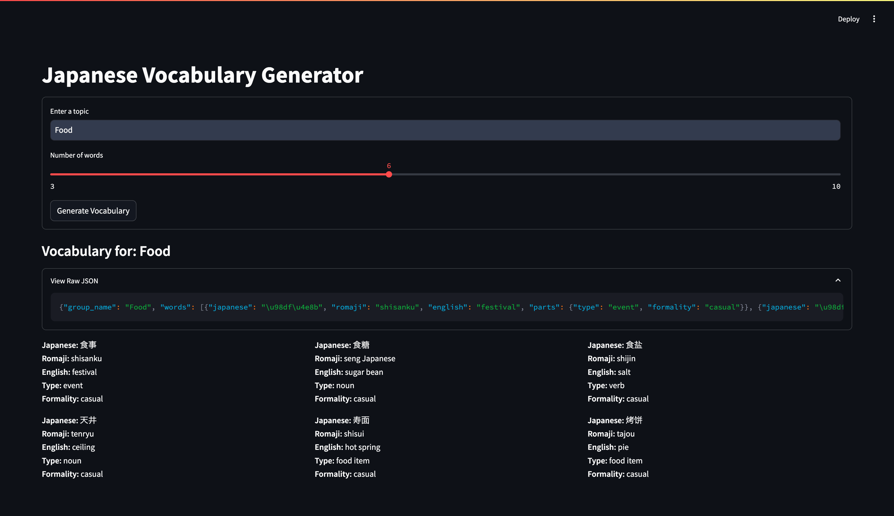

# Japanese Vocabulary Generator

A Streamlit application that generates Japanese vocabulary words based on user-provided topics.

Japanese Vocabulary Generator



## Setup

### Prerequisites
- Python
- Docker and Docker Compose (optional, for containerized setup)

### Local Setup

1. Create a virtual environment:
```bash
python3 -m venv venv
```

2. Activate the virtual environment:
```bash
# On Unix/macOS
source venv/bin/activate

# On Windows
.\venv\Scripts\activate
```

3. Install the requirements:
```bash
pip install -r requirements.txt
```

4. Run the application:
```bash
streamlit run app.py
```

The application will be available at `http://localhost:8501`

### Docker Setup

Build and run using Docker Compose:
```bash
docker-compose up --build
```

The application will be available at `http://localhost:8501`

## Configuration

The application can be configured using the following environment variables:

- `BACKEND_SERVICE_URL`: URL of the backend service (default: http://0.0.0.0:8888)

Example:
```bash
# Local setup
export BACKEND_SERVICE_URL=http://api.example.com

# Or when using docker-compose, modify the environment section in docker-compose.yml
```

## Development

To modify the backend service URL for local development:

1. Create a `.env` file:
```bash
BACKEND_SERVICE_URL=http://localhost:8888
```

2. Run the application with the environment file:
```bash
# Local setup
set -a; source .env; set +a; streamlit run app.py

# Docker setup
docker-compose --env-file .env up
```

## Project Structure

```
vocab_generator/
├── app.py              # Main Streamlit application
├── Dockerfile          # Docker configuration
├── docker-compose.yml  # Docker Compose configuration
├── requirements.txt    # Python dependencies
├── README.md           # This file
└── tech_specs.md       # Technical specifications
```
