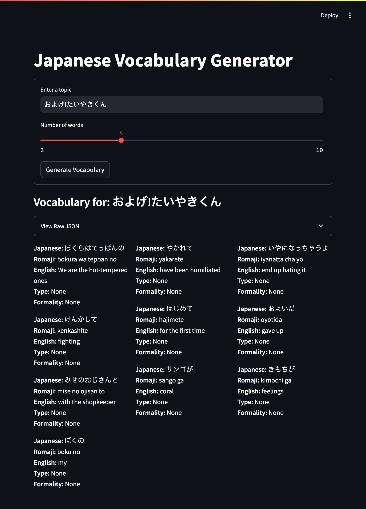
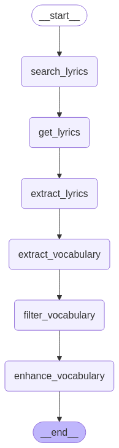

# Song Vocab

An application to extract a vocabulary from a song.



LangGraph Workflow of the Song Vocab app



[Song Vocab LangGraph Mermaid file](assets/song-vocab.mermaid)

## vLLM
I tried to use vLLM but ran into issues trying to make it work.
There are no pre-built solutions to run on macOS, so it needs to be compiled from scratch. I first tried to build the Docker image, but that failed due to a missing dependency. Then I tried build from source, which succeeded, but when I tried to invoke the model, it was only generating exclamation marks. See a [similar issue](https://github.com/vllm-project/vllm/issues/13035).
I tried downgrading to v0.6.6, but then I couldn't even compile the code because the dependency installation failed with `ERROR: No matching distribution found for torch==2.5.0+cpu`.
I decided to use Ollama again as that has a Docker image and just works.

## LangChain vs LlamaIndex
After skimming through the [LangChain](https://python.langchain.com/docs/introduction/) and [LlamaIndex](https://docs.llamaindex.ai/en/stable/) documentation and reading comparisons between the two LLM frameworks, LlamaIndex seemed more useful when connecting with databases and LangChain seemed more useful when building agents.
Both could be used to build this project, but I decided to go with LangChain because it has a more extensive documentation with many examples.


## {agent_scratchpad}

I noticed that the prompt template included a `{agent_scratchpad}` placeholder and I wondered what it was for.
This was the summary of it's purpose, provided by Windsurf's chatbot:

> The `{agent_scratchpad}` is a special placeholder in LangChain's ReAct (Reason+Act) agent prompt template. 
> 
> It's where the agent keeps track of its thought process and actions in a structured format:
> - Thought: The agent's reasoning about what to do next
> - Action: The tool the agent decides to use
> - Action Input: The input to pass to the tool
> - Observation: The result from the tool
> 
> This format helps the LLM:
> - Keep track of what it has done
> - See the results of previous actions
> - Make decisions about what to do next
> - Build up the final response step by step


## LangChain vs LangGraph

After many unsuccessful attempts to get LangChain to work, especially around making the agent call the right tool in the right order, I found out that [LangGraph](https://langchain-ai.github.io/langgraph/) seems more suitable for the task I was trying to achieve. LangGraph lets you define a workflow as a sequence of steps with clearly defined transitions between them, which is a perfect fit because I had series of steps (get lyrics URLs, download lyrics, extract vocabulary, enhance vocabulary, see [tools.py](tools.py)) that needed to be performed to get the final result. LangChain is better suited for building agents that can enhance the chat experience by deciding to call a tool if needed based on the messages from the user. The tool can be defined as a LangGraph workflow, so both can be combined to build a more advanced agent.

Building an agent is challenging because it requires experimenting with promting techniques to make the LLM choose the right tool. One trick that helped a lot with troubleshooting was to set `langchain.debug = True` to be able to see what the LLM was doing.

## Setup

1. Create a virtual environment:
```bash
python3 -m venv venv
```

2. Activate the virtual environment:
```bash
# On Unix/macOS
source venv/bin/activate

# On Windows
.\venv\Scripts\activate
```

3. Install the requirements:
```bash
pip install -r requirements.txt
```

4. Run the application:
```bash
python app.py
```

### Setup Ollama

This project uses [Ollama](https://ollama.com/) as the LLM service. Follow the instructions in [opea-comps/llm](../opea-comps/llm/README.md) to set up Ollama locally.

### Setup Frontend

This project reuses the frontend from [opea-comps/vocab_generator](../opea-comps/vocab_generator/README.md).

Remember to set the `BACKEND_SERVICE_URL` environment variable to `http://0.0.0.0:8000/extract_vocabulary` before starting the frontend.

```bash
export BACKEND_SERVICE_URL=http://0.0.0.0:8000/extract_vocabulary
```

Note that the number of words slider has no effect and that it takes a long time to get a result (around 5 minutes in my tests).

## Usage

You can try the app in three ways:
- The frontend from [opea-comps/vocab_generator](../opea-comps/vocab_generator/README.md)
- The API docs at [http://0.0.0.0:8000/docs](http://0.0.0.0:8000/docs)
- Using curl

Using the song name `およげ!たいやきくん`:

```bash
curl -X POST -H "Content-Type: application/json" -d '{"topic": "およげ!たいやきくん"}' http://0.0.0.0:8000/extract_vocabulary
```

Response:

```json
{
    "group_name": "およげ!たいやきくん",
    "words": [
        {
            "japanese": "ぼくらはてっぱんの",
            "romaji": "bokura ha teppan no",
            "english": "We are the barbecue guys",
            "parts": null
        },
        {
            "japanese": "みせのおじさんと",
            "romaji": "mise no ojisan to",
            "english": "with the old man at the shop",
            "parts": null
        },
        {
            "japanese": "けんかして",
            "romaji": "kenka shite",
            "english": "having fought",
            "parts": {
                "type": "verb",
                "formality": "plain"
            }
        },
        {
            "japanese": "ぼくのすみかさ",
            "romaji": "boku no sumikasa",
            "english": "my nest",
            "parts": null
        },
        {
            "japanese": "いわばの",
            "romaji": "iwaba no",
            "english": "basically, in a sense of",
            "parts": {
                "type": "adverbial phrase",
                "formality": "polite"
            }
        }
    ]
}
```
